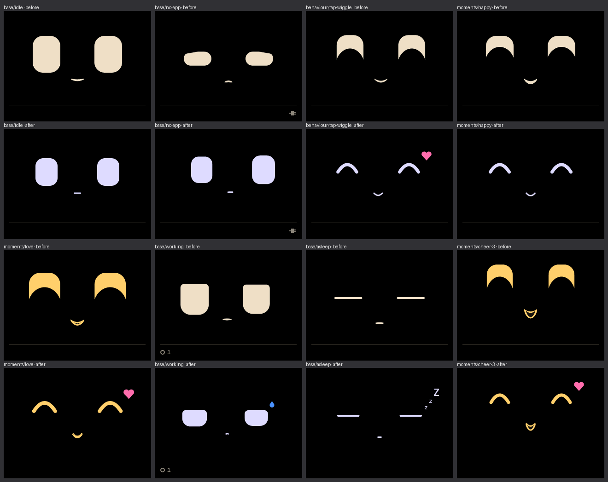
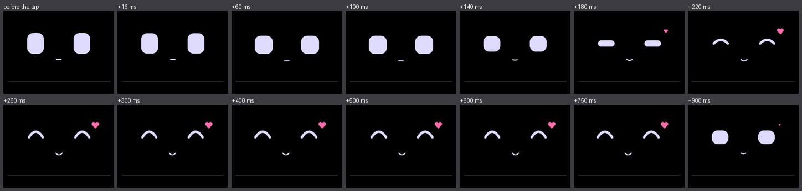
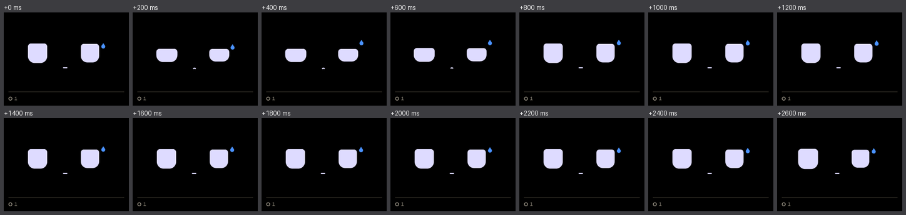
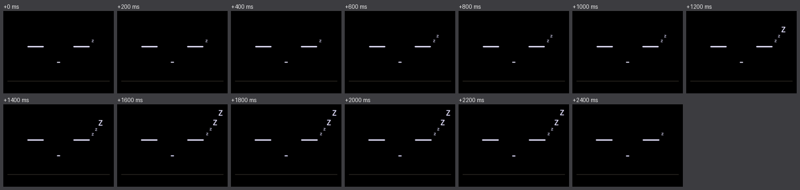

# Gen-2's look (F6 follow-up), 2026-09-26

After F6, the owner looked at the board and said three things:

- The eyes don't look as cute as before.
- The smile when tapped looks a bit frightening.
- The default face has droopy eyes. That was the no-app face, which the
  board showed from the F6 flash until the Mac app started.

They asked for the face to look like gen-2's older faces. After seeing the
first pass on the board ("this looks much better"), they asked for three
more things:

- Replace the pink cheeks with a heart at the top right of the face.
- Add a "zzZZ" when asleep.
- Add some effort to the working face.

## What changed

- **Eyes.** 48 × 60 px with a 17 px corner, still 134 px apart. The eye is
  now a third of the spacing, as on gen-2, so there's plenty of black
  between the eyes. The eye colour is gen-2's lavender-white (222, 219, 255).
  Gen-2 actually drew neutral grey, and its 8-bit colour turned it lavender;
  that's the colour the owner remembers. Text stays oat, with a new
  `kInkText`.
- **Happy eyes.** Thin "^" arches: a 7 px stroke with round ends that rises
  16 px, like gen-2's. The v1 crescents (a solid dome with a bite out of the
  bottom) read as hooded, glaring eyes. The stroke is the union of discs
  along a parabola, filled a column at a time. As `lidBot` rises, the eye
  squeezes to a 7 px bar, and from 450 the bar bends up, fully by 650. The
  bar and the flat arch are the same shape, so a blend never jumps.
- **Heart.** `Pose::heart` pops a rose heart in at the top right of the
  face, growing with the blend. It shows on a tap, a cheer of size 2 or 3,
  love and level-up. The first pass drew rose cheeks there instead; the
  owner swapped them for the heart.
- **Asleep.** `Pose::zzz` draws "zzZZ" (two small z's, then two large Z's)
  climbing up and to the right of the right eye, one letter at a time over
  a 2.4 s cycle. The last Z stays on screen.
- **Working effort.** Every 2.6 s (1.8 s with three or more sessions busy),
  a 0.8 s strain: the eyes squash wider and lid down, the mouth tightens,
  and a 2 px shiver runs through the face. `Pose::sweat` slides a sky-blue
  drop down beside the right eye over 3 s, again and again.
- **Mouth.** A round-ended line, 16 px wide at rest and up to 40% wider as
  a smile. Idle is a flat dash, and happy is a closed "u". Open mouths keep
  v1's bowl.
- **Tap.** `wiggle` is the arches, a smile and the heart. It sways twice
  (350 ms, 4 px); the old 175 ms, 7 px shiver looked like trembling on
  camera.
- **No app.** The eyes are open and glance up and aside, as gen-2 did while
  waiting for contact, not the sleepy half-shut look.

In the simulator, a tap, then working and asleep over one cycle each:

## Checks that ran

| Check | Result |
| --- | --- |
| `make fw-test` | 91 test cases, 91 passed. New: a tap is arches and a heart, up and right of the right eye and never below the eyes; the heart grows in with the blend; the happy blend squeezes, then arches; the no-app eyes are open and look up; "zzZZ" adds a letter at a time and the last Z fits on screen; the sweat drop sits right of the right eye and slides down 10 px or more; the working face strains for part of each cycle and rests for most of it, with the drop throughout; asleep always has "zzZZ", and idle has neither. The face tests' thresholds follow the smaller eye (at least 4,000 eye pixels rather than 7,000, and rows and widths scaled for 48 px). The "working, night, starving" pose is no longer checked mid-blink. There its low lid leaves a 2 px tip on a 12 px sliver for about 90 ms: the case F6 already reported, a little sharper at this size. Held, it has no point |
| `make sim`, then `tools/boopctl sim` | Every changed golden was looked at before and after ([goldens-sheet.png](goldens-sheet.png)) and accepted; a rerun gives 11 scenarios, 0 expect failures and 0 changed pictures. The speed changes (a table of disc heights for the arches, 32-bit maths for the drop) left every picture identical |
| `make fw` | Builds. Flash 56.2% (1,104,063 bytes); static RAM 45,988 bytes |
| `make flash` | Written and verified. `ping` gives `"sha": "c6e9149840-dirty"`, `"w": 320`, `"h": 240`, and the Mac app reconnected over Bluetooth by itself after each flash |
| Board screenshots ([board-screens.png](board-screens.png)) | With the clock frozen and stepped: asleep with all four letters of "zzZZ"; a tap 400 ms in, with the arches, smile and heart; working mid-strain, eyes squashed and lidded, the mouth tight, the drop beside the right eye. For the working shot the state was sent over USB for a few seconds, then the Mac app's own state took over again |
| `tools/boopctl perf --motion` | 60 s: minimum 41 fps, mean 67.5, minimum free heap 72,684 bytes, no reset ([perf-motion.json](perf-motion.json)). The tool's base state is working, so the face never rests. With the Mac connected over Bluetooth. Filling the heart by testing its curve at every sample in 64-bit maths gave a 30 fps minimum; filling it as scanline spans restored 41 |
| Webcam, first pass (owner-authorised; the board lay flat, USB-C on the right) | Framing passed. The test pattern check passed: UP at the top, the USB-C bar on the right, and red, green, blue, white, black and amber all right. A 6 s clip of two taps ([webcam-taps-first-pass.png](webcam-taps-first-pass.png), 18 frames looked at as a sequence, not in real time) showed the first pass's arches, cheeks and smile on the panel. Two frames showed doubled, bluish arches, which is the camera blurring the old fast sway; that's why the sway was slowed |
| Webcam, second pass | Not done. By then the board was no longer in the camera's view: the two clips showed the room, not the screen. They were deleted, and the camera wasn't used again |

## Not run

- **A full L2 `tools/boopctl run`.** The owner's Mac app was connected over
  Bluetooth and sends a state every 10 s. That would land in the middle of
  the scenarios, and CLAUDE.md says not to quit or launch the app from an
  agent. Run it with the app quit to get the pixel-for-pixel board check.
- **The second pass on camera**, and the owner's own look at it.

## Files here

- `before-after.png`: the F6 goldens above the new ones for idle, no app,
  tap, happy, love, working, asleep and cheer 3
- `goldens-sheet.png`: all 83 new goldens at half size
- `tap-strip.png`, `working-strip.png`, `asleep-strip.png`: the simulator
  over time
- `board-screens.png`: USB screenshots from the board, asleep, tap and
  working
- `webcam-taps-first-pass.png`: the first pass's cropped webcam sheet, at
  half size (raw video deleted)
- `perf-motion.json`: `boopctl perf --seconds 60 --motion`
