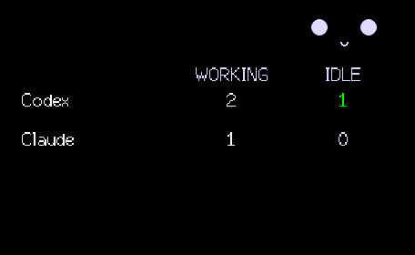
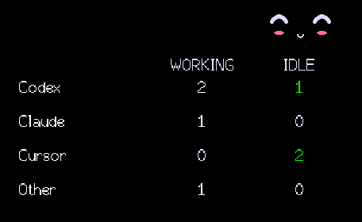
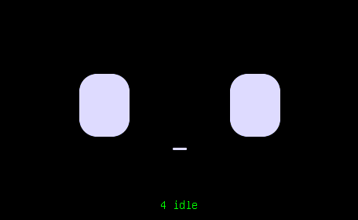

# Agent availability dashboard — 2026-09-11

Implemented the persistent mixed working/idle count board on Waveshare ESP32,
with Codex/Claude/Cursor/Other rows, green non-zero idle counts, a small animated
corner face and a 550 ms pull-in/pull-out transition. All-working uses the working
face; all-idle uses the idle face and green idle total. Idle taps remain affection.
Counts come from all tracked host sessions, independently of the six-row preview.

## Verification

- `make test`: **344 passed, zero skipped**, including full-session aggregation,
  lifecycle/stale removal, request priority and maximum escaped wire payloads.
- Shipping `ws-amoled164` and `ws-amoled164-usb-debug` builds succeeded.
- USB-only device tests: **11 passed**, including persistence beyond ten seconds,
  state exits, idle affection, request priority, old-host omission, malformed
  rows and pixel stability across repeated animation frames.
- Animation clock source guard passed; `git diff --check` passed.
- Actual device screenshots inspected: mixed pointing/smiling, four harnesses,
  all idle and all working. No webcam was used. The image preview appeared to omit repeated labels, but comparison of the
  saved PNG pixel data confirmed those labels were present and unchanged.
  Opaque board drawing and repeated-frame pixel checks are retained.
- The secondary M5 build compiled/linked but exceeded its 1,572,864-byte app
  partition (1,735,057 bytes in that build). It was not flashed. This change is
  verified for the Waveshare target; M5 release size remains unresolved.

## Hardware and remaining gate

Used the machine-wide reservation and compile-time USB-only firmware. The first
full-flash backup failed with a serial-stream error before any write. A bounded
backup of every overwritten region succeeded. A subsequent test attempt lacked
pytest; normal firmware was restored. After installing pytest into a temporary
venv, the tests and captures ran successfully. Saved normal firmware/settings
were restored before installing the verified candidate's normal BLE-enabled
build. Final installation status is in `device-run.json` and `device-restore.log`.
Raw flash backups are private temporary artifacts, not repository evidence.

Production BLE integration with the updated Mac app remains unverified. The
owner must launch the updated Boop app from this worktree; agents must not launch
the Bluetooth GUI. An older running host does not emit the additive `agents`
field and therefore retains the older face-only behavior.

## Cuter invitation refinement

The buddy now sits directly above IDLE in the upper-right corner at 28% scale
(previously 22% at the opposite corner). Each entry starts a 5.6-second loop:
anticipatory squish, two downward nods at the idle column, rosy smile toward
the owner, then a long rest. The independent arrow is removed. Cheeks scale
with the small face, and labels/counts remain stationary. This refinement
changes firmware presentation only; host aggregation and wire behavior are
unchanged. Verification and captured animation are recorded below.

The refinement passed **12 USB hardware tests**, including full-loop pixel
stability across re-applied frames. Both Waveshare firmware variants built;
the animation clock guard passed. The board uses proportional Font2 for its
fixed ASCII labels. `dashboard-invitation.gif` is a timed, sampled preview
assembled from actual device screenshots (the live device animates smoothly
between these samples). No webcam or inferred user-view event is involved.

Normal firmware installation completed successfully (`cute-install.json`);
the final ping reported `usbOnly: false`. The device is running the refined
dashboard build.

## Main integration

Rebased onto the cumulative-XP/daily-activity changes in `8bfee43`, preserving
the compatibility snapshot fields and device stats changes. The integrated
revision passed **345 app tests, zero skipped**, and the shipping Waveshare
firmware build. Existing USB evidence above predates this integration; the
combined image was built but not re-flashed during the merge.
