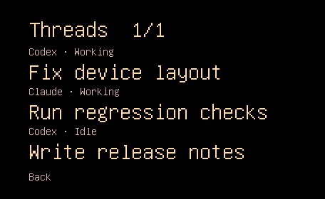
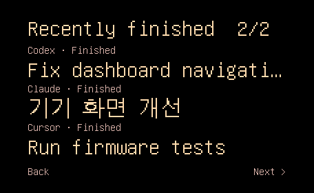

# Dashboard exit and spacing — 2026-09-11

Work is isolated in `codex/dashboard-navigation-spacing`, based on b094403.

## Changes

- Normal dashboard taps return immediately, rather than traversing all thread
  and history pages. Back is always visible; only bottom-right Next pages.
- Physical short taps exit before a hidden dialogue bubble can consume the tap.
- Left alignment is retained with 40 px side and 24 px top/bottom margins.
- USB-only `tap X Y` exercises the same coordinate handler used by the panel.
  It is absent from normal firmware. No wire payload or Mac code changes.

## Verification

Both shipping and USB-only firmware built. Python syntax checks and git diff
whitespace checks passed. 19 USB hardware checks passed, including multi-page panel exit, Next wrapping,
history exit, hidden-bubble priority, physical-button exit and invalid coordinate
rejection. Three changed/new goldens (thread, long-title and history) each matched
an independent recapture at exactly zero pixel error. All three screenshots were
visually reviewed; non-black content bounds confirm the specified margins.
See `hardware-checks.txt`, `content-bounds.json` and the captured images.

Another worktree is testing firmware concurrently. This run backs up and restores
whatever normal image/settings it finds; it does not leave its candidate installed
or overwrite the other task's changes. No webcam access is used.

