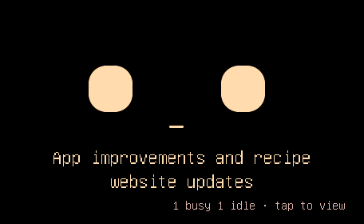

# Brief phrase below the face — 2026-09-12

The device shows each different work phrase once for four seconds, with a 250 ms
arrival and 400 ms departure. Centered 24 px text sits below the face at y=184
and y=214; the face lifts 28 px and shrinks 14%. The 16 px session hint is right
aligned, 24 px from the right and 32 px from the bottom. Low battery moves left
when that hint is present. The Mac retains its summary.

## Verification

- Normal and USB-only firmware builds passed on the final source.
- 31 USB scope/navigation checks passed. One incomplete screenshot transfer was
  recaptured by the existing bounded retry; the completed capture passed CRC.
- The hint pixel regression checks arrival, settled, departure and expiry.
- Eight affected existing golden scenes were captured independently twice and
  matched at zero pixel difference before recording: glance-working, glance-last,
  and scope face/idle/dashboard in English and Korean. Snapshot preparation
  supplies a distinct phrase so identical-text suppression stays enabled.
- After the final UTF-8 bounds guard, all 9 focused scope checks passed and
  the sixteen lifecycle screenshots were recaptured.

The sixteen lifecycle PNGs cover short, two-line, overflowing and idle-only
phrases. `states.json` records the matching device state. `capture.py` reproduces
these scenes and the affected goldens; run it only inside the USB-only device
wrapper with setup/restoration, as documented in `tools/dev/README.md`.

## Installation and limits

Every run backs up the attached device and restores its previous normal firmware.
The observed previous image is `0.0.1-readiness.1` (`0c7f1d0e9b1a`), which differs
from the older installed-image entry in PLAN.md. Completed runs restored it successfully with `usbOnly=false`.
One later backup read was interrupted by USB serial noise before the candidate
was installed; restoration succeeded and the final checks were retried using
the already verified backup. Final restoration is recorded in `device-run.json`.

No normal candidate was installed for everyday use, and nothing was published.
This verifies USB rendering and timing, not production Bluetooth or live-model
word choice. Only the bundled behavior guide changed; existing owner guide
edits were not overwritten, and the Mac app was not rebuilt or restarted.
