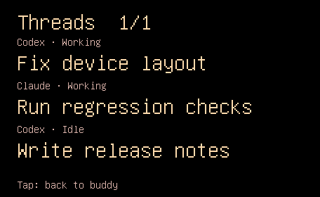

# Glanceable activity and completion notices — 2026-09-11

## Implemented

- Working face and total working count; mixed sessions no longer force a board.
- Five-second completion notice with sage wash, agent and large title. Overlaps
  update one notice, capped at eight seconds, followed by a three-second cooldown.
- Quiet last-finished footer; explicit three-row thread/history pages on tap.
  Stable session ordering keeps status changes from shuffling rows. Secondary
  tap exits; physical primary hold retains affection. Attention stays dominant.
- Codex titles from bounded local index metadata; explicit hook title aliases
  for other harnesses; project plus stable ID fallback. No transcript reads.
- At most twelve thread preview rows and six recent completions, with explicit
  total/omitted counts. Frame budget remains 1536 bytes; large frames shed
  optional snapshot, cosmetics, history and preview rows without losing counts
  or the newest finish. Titles are capped to 47 UTF-8 bytes.

## Automated evidence

357 app tests passed, zero skipped. Both Mac products built. Both shipping
Waveshare and USB-only verification firmware built. See logs and image hashes.
Tests include timing boundaries, cooldown, duplicate/failure/removal behavior,
attention priority, title privacy/fallback/index parsing, stable rows and frame
bounds with multilingual/escaped titles.

## Physical evidence

The first USB run passed 11 checks and restored the original normal image.
Visual review found fragmented fractional-size labels; the final firmware uses
integer font sizes. The final USB run passed 12 checks including control-byte
rejection. All 44 goldens were re-recorded and matched an independent second
capture at exactly zero pixel error. English/Korean completion titles, grouped
finishes, working/footer and thread pages were visually reviewed. The full
contact sheet was also reviewed. Normal firmware `dev+1b4976d44e34` was installed after restoring the original
image/settings. The device reports `usbOnly=false`, `safe=0`, and its panic
counter remains 103 (unchanged from before testing). See `hardware-result.json`,
`installed-normal.json` and `firmware-sha256.json` for the exact build evidence.
Hardware verification uses the shared reservation and a complete backup of the
installed image/settings. No webcam was used. USB tests are not production BLE
integration evidence; that needs the owner-launched updated Mac app.

## Remaining live gate

The running Mac app at the start of this change was PID 88899, from the main
checkout, with the old wire mapper. The owner must quit it and launch this
worktree's rebuilt `app/.build/debug/Boop`. Production BLE completion/title
verification remains open until that build is owner-launched. No agent launched
or stopped the GUI app. Webcam motion verification was not requested or used.
