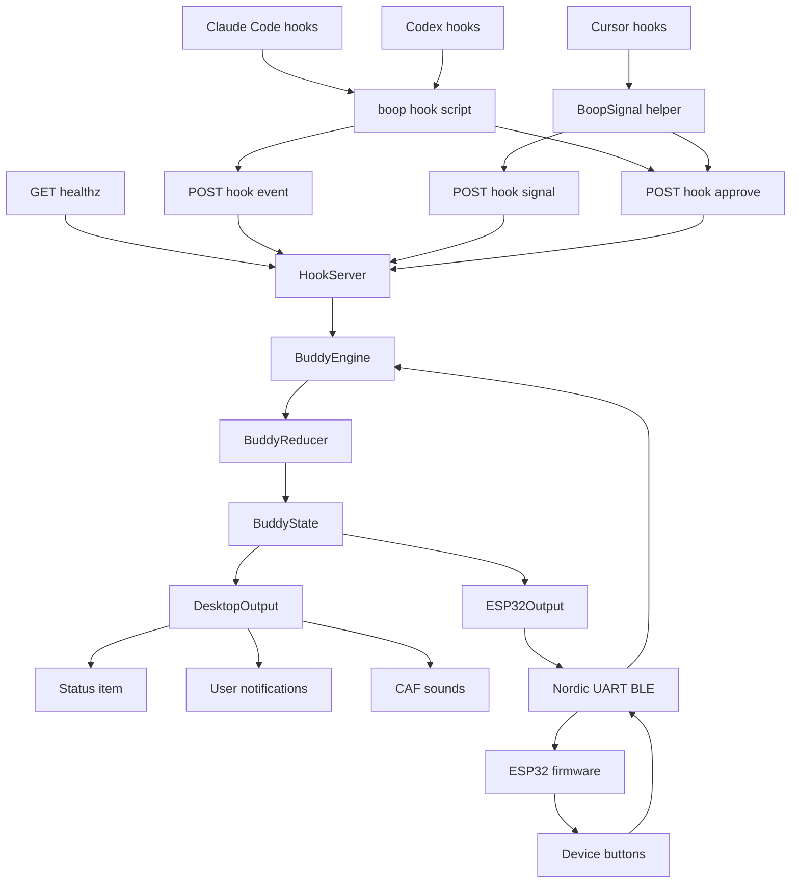
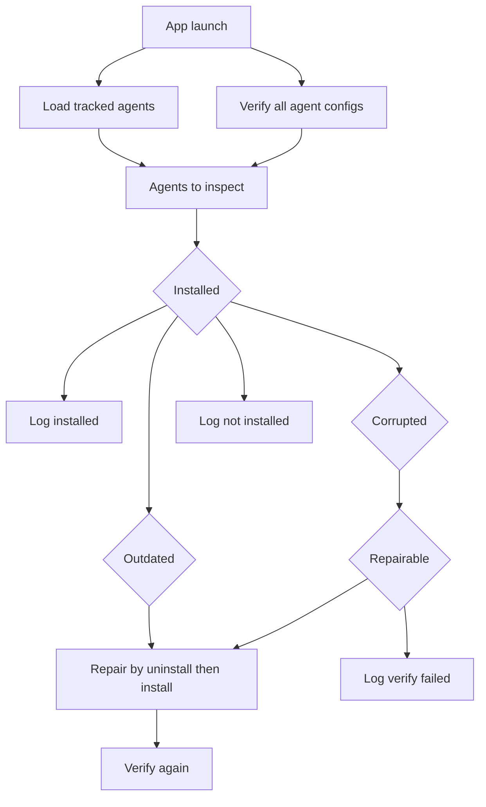
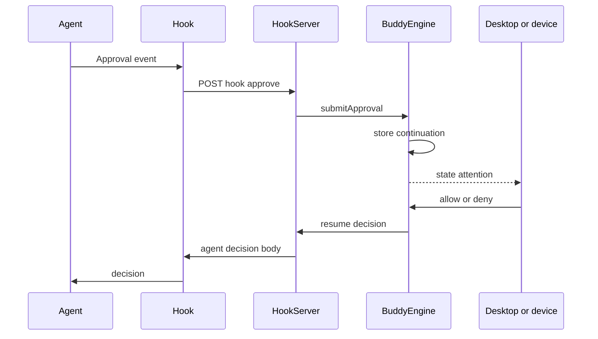
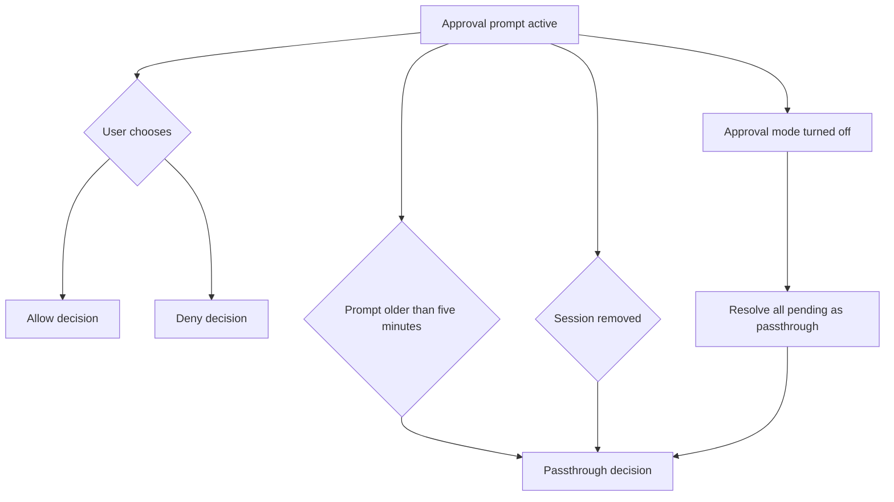
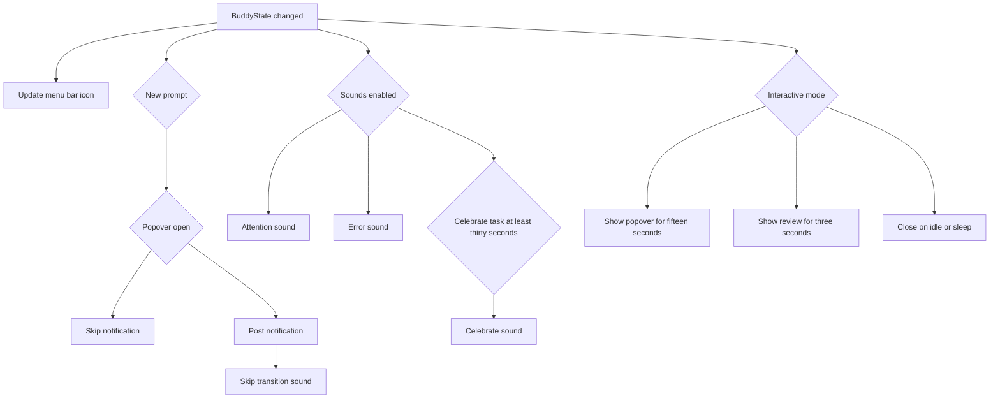
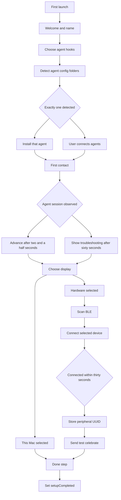
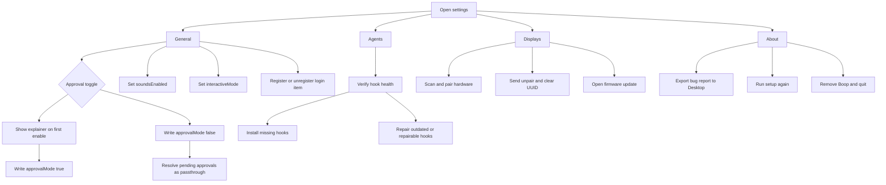
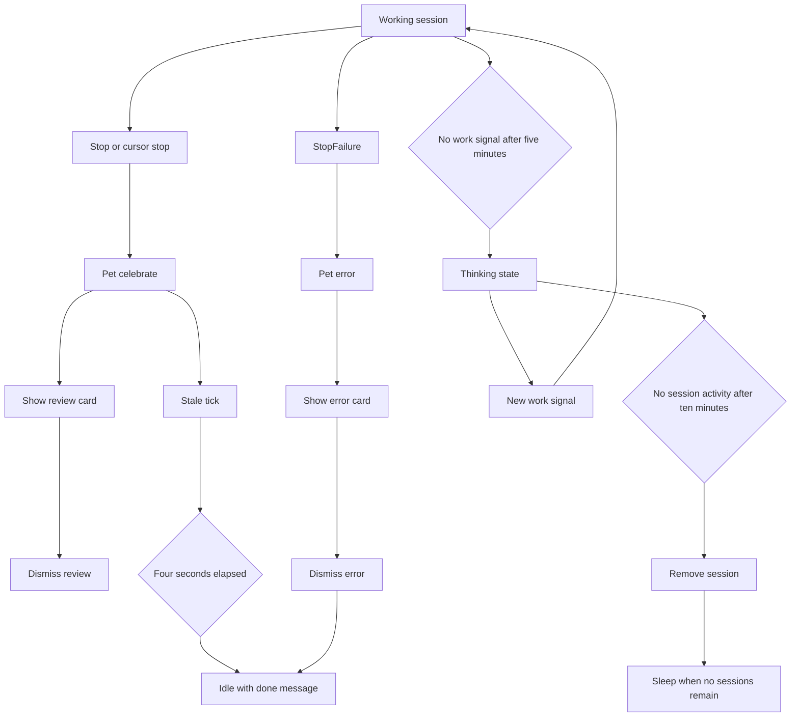
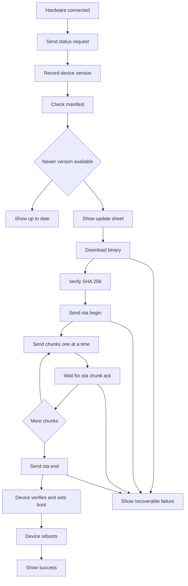

# Boop App Architecture

This document is the source-derived architecture reference for the Swift macOS
app in `app/` and the firmware boundary in `firmware/esp32/`. The active
runtime path is:

```text
agent hooks -> HookServer -> BuddyEngine -> pure reducer -> OutputProvider
```

Inputs adapt external agent payloads. Core owns state transitions. Outputs
render or relay `BuddyState`. Agent parsing, clocks, defaults, HTTP, UI, BLE,
and firmware I/O stay out of the reducer.

## Runtime Overview

| Area | Current implementation |
| --- | --- |
| macOS app | Swift 6 package, SwiftUI and AppKit menu bar app, macOS 14 minimum |
| Local server | Hummingbird on `127.0.0.1:21321` by default |
| Local auth | `X-Boop-Token` header on hook routes, token in `~/.boop/config.json` |
| State | `@Observable` `BuddyEngine` plus pure `reduce(_:_:)` |
| Agents | Claude Code and Codex bash hook, Cursor `BoopSignal` helper |
| Desktop output | Status item icon, notifications, sounds, interactive popover |
| Hardware output | CoreBluetooth Nordic UART Service heartbeat JSON to ESP32 |
| Firmware | Device renderer, buttons, BLE, USB debug, OTA |
| Tests | Swift tests, generated local fallback, snapshots, HTTP e2e, firmware HIL |



## Repository Map

| Path | Role |
| --- | --- |
| `app/Boop/App/` | App delegate, entry point, Sparkle, login item, uninstall, snapshots |
| `app/Boop/Core/` | State, events, reducer, engine, config, diagnostics, protocols |
| `app/Boop/Server/` | Hummingbird localhost adapter |
| `app/Boop/Install/` | Agent hook installer and generated shell script |
| `app/Boop/Outputs/Desktop/` | Desktop output provider |
| `app/Boop/Outputs/ESP32/` | BLE output, heartbeat, firmware release, OTA protocol |
| `app/Boop/Views/` | Popover, settings, onboarding, firmware update sheet |
| `app/BoopSignal/` | Cursor hook helper executable |
| `app/Tests/` | Reducer, engine, hook server, installer, resource, copy, snapshot tests |
| `app/tools/` | E2E smoke tests, package, release preflight, appcast helper |
| `firmware/esp32/firmware/` | ESP32 app source |
| `firmware/esp32/tools/` | Hardware test and flashing helpers |

## Local Config And API

`BuddyConfig.default` creates `~/.boop/config.json` with mode `0600`.

| Key | Meaning |
| --- | --- |
| `port` | HTTP port, default `21321` |
| `token` | 32 random bytes as a hex string when `SecRandomCopyBytes` succeeds, with a two-UUID fallback |
| `approvalMode` | Boolean local approval mode, missing means `false` |

Default timings:

| Constant | Value | Source behavior |
| --- | ---: | --- |
| `staleTimeoutMs` | `600_000` | Reap sessions with no activity after 10 minutes (sessions with a live process watcher are exempt) |
| `approvalTimeoutMs` | `290_000` | Clear prompts and approval waits; deliberately below the hook script's 300 s curl `--max-time`, which is below the registered 310 s hook timeout, so each layer's card dies before its caller gives up |
| `workStallTimeoutMs` | `300_000` | Move silent working sessions to `thinking` after 5 minutes |
| `celebrateDurationMs` | `4_000` | Keep celebrate state active for 4 seconds |
| stale timer | `2.0` seconds | Engine periodic `staleTick` interval |

Routes:

| Route | Auth | Purpose |
| --- | --- | --- |
| `GET /healthz` | none | Returns `ok`, `stateVersion`, and `desktop` |
| `POST /hook/event?source=...&pid=...` | `X-Boop-Token` | Non-blocking lifecycle and tool events |
| `POST /hook/signal` | `X-Boop-Token` | Cursor helper lifecycle and activity signals |
| `POST /hook/approve?source=...` | `X-Boop-Token` | Blocking local approval path |

Hook request bodies are collected up to `1_048_576` bytes. Token comparison is
constant-time. The server derives session ids from `session_id`,
`conversation_id`, or `source` plus a stable SHA-256 hash prefix of `cwd`.
Hints are taken from command, tool description, command path, URL, query, or
message and are capped to 200 characters before entering core state.

## Agent Inputs And Hook Health

All installed hooks are fail-open. If config, token, server, or curl is
unavailable, hooks exit successfully and let the agent continue.

### Claude Code

`HookInstaller` writes nested command hooks to `~/.claude/settings.json`.
Plain event hooks have timeout `5`. `PermissionRequest` has timeout `310`
because the script can wait up to `300` seconds on `/hook/approve`.

Installed plain events are `SessionStart`, `UserPromptSubmit`, `Stop`,
`StopFailure`, `SessionEnd`, `PostToolUse`, `Elicitation`, and
`ElicitationResult`. Notification matchers are `permission_prompt`,
`idle_prompt`, and `elicitation_dialog`.

When approval mode is on, the generated script first proves the server is
answering with a 2 second `/healthz` probe (a hung-but-listening app must not
hold the agent for the full wait), then routes `PermissionRequest` to
`/hook/approve?source=claude-code&pid=$$` with connect timeout `2`, max time
`300`, and `-f` so a non-2xx body is never relayed as hook output. Other
events route to `/hook/event?source=claude-code&pid=$$` with connect timeout
`1` and max time `5`.

### Codex

`HookInstaller` writes `~/.codex/hooks.json` and ensures
`codex_hooks = true` in `~/.codex/config.toml` under `[features]`. Installed
events are `SessionStart` with matcher `startup|resume`, `UserPromptSubmit`,
`PermissionRequest`, `PreToolUse`, `PostToolUse`, and `Stop`. Codex uses the
same generated `~/.boop/boop-hook.sh` with `source=codex`.

### Cursor

`HookInstaller` writes `~/.cursor/hooks.json` and installs
`~/.boop/bin/boop-signal --agent cursor`. Installed events are `sessionStart`,
`sessionEnd`, `beforeSubmitPrompt`, `stop`, `beforeShellExecution`,
`beforeMCPExecution`, `afterShellExecution`, and `afterMCPExecution`.

`BoopSignal` maps Cursor events to `/hook/signal`. In approval mode,
`beforeShellExecution` and `beforeMCPExecution` go to `/hook/approve` after a
2 second `/healthz` liveness probe, with a 300 second URLSession timeout and
semaphore wait. Mapped non-blocking Cursor hooks print
`{"permission":"allow"}` as protocol plumbing; events the helper does not
recognize answer `{"permission":"ask"}` so an unknown future gating event can
never be approved unseen. If approval forwarding fails, Cursor receives
`{"permission":"ask"}`.

Cursor auto-approval is server-side and conservative. `Read`, `Glob`, `Grep`,
`LSP`, and `WebFetch` auto-allow. Shell hints auto-allow only for read-only
patterns starting with commands such as `ls`, `cat`, `rg`, `date`, or safe
`git status`, `git log`, `git diff`, `git show`, `git branch`, `git remote`,
and `git tag`. Any `;`, `&`, `|`, backtick, `$`, parentheses, redirection, or
newline disables auto-approval.

### Health And Repair

Hook schema version is `3`, and the shared script filename is
`~/.boop/boop-hook.sh`. Health states are `notInstalled`, `installed`,
`outdated`, and `corrupted`. Repairable states are outdated hooks and corrupted
states except invalid Claude `settings.json`, invalid `hooks.json`, and an
unreadable hook script.

On launch, `AppDelegate.verifyManagedHooksAfterLaunch()` checks agents that
were previously installed or currently detected. Outdated and repairable hooks
are reinstalled. Non-repairable corruption is logged. Writes back up existing
agent files under `~/.boop/backups` and keep the latest three backups per
agent-file prefix.



## Core State Model

`BuddyEvent` is the reducer input language. It includes session lifecycle,
request arrival and clearing, activity signals, stale ticks, approval arrival
and resolution, species changes, review dismissal, and error dismissal.

The reducer is pure. It receives time as `BuddyEvent.at`, returns a new
`InternalState`, increments `BuddyState.version` once per real change, and
aggregates public `BuddyState` from session internals.

`InternalState` owns:

- `buddy: BuddyState`
- session dictionary keyed by session id
- stale, celebrate, work-stall, and approval timeouts

`BuddyState` projects:

- state `version` and `updatedAt`
- desktop status and last heartbeat timestamp
- aggregate session counts
- message line, recent entries capped at 10, prompt, pet, and last signal
- celebrate fields and last completed task
- first errored and first thinking sessions
- active session summaries capped at 6
- current activity kind

Session state includes source, state, prompt, cwd, last activity, work start,
last work signal, last and current tool or hint, and activity kind.

Pet aggregation priority is:

1. no sessions gives `sleep`
2. any waiting prompt gives `attention`
3. any errored session gives `error`
4. any working session gives `busy`
5. any thinking session gives `thinking`
6. active celebrate window gives `celebrate`
7. otherwise connected gives `idle`

A device boop (`{"cmd":"boop"}` over BLE) sets a ~2.5s `affectionUntil`
window that overlays `heart` onto the calm states (`idle`, `busy`,
`thinking`, `celebrate`) — mirroring the firmware, `attention`/`error`
always win and `sleep` stays asleep (the device does its sleep-peek
locally). The base state's `msg`/`lastSignal` survive the flash.

The app intentionally treats `thinking` as quiet work, not failure. A session
becomes thinking only after both `lastWorkSignalAt` and `workStartedAt` are
older than `workStallTimeoutMs`.

Activity kind is pure classification from tool and hint: read tools, web
tools, write tools, shell tools, test-like shell commands as `verify`, and
everything else as `work`.

## Personality And Agent Embodiment

Design and invariants: `archived/research/eng/personality-and-embodiment.md`.

`PetMemory` (in `InternalState`, persisted via `PetMemoryStoring` to
`~/.boop/pet-memory.json`) holds `lastSeenAt`, a UTC hour-of-day activity
histogram (one sample per ~30 min of presence), lifetime counters, and
per-agent identities. The reducer owns every mutation; `BuddyEngine` loads it
at startup (`.memoryLoaded`) and writes it back when it changes. Derived
behavior, all reducer-side:

- return greeting after an 18h+ gap (`greetUntil`/`greetLevel`, rendered as
  `.heart` over calm states plus a `greet` heartbeat flag)
- circadian mood: `expectant` (awake at the usual start hour with no
  sessions), `surprised` (new session at an hour the user never works);
  neutral until the histogram has 20+ samples over 14+ days
- effort tier for the busy state from work span and per-session error count,
  overridden by an agent's own `report_effort`
- celebration intensity 1–3 scaled by duration and errors (never approvals)

The MCP server (`Server/MCPServer.swift`) is an input adapter mounted at
`/mcp` on the hook server port, registered per agent by `HookInstaller`
(claude-code `~/.claude.json`, cursor `~/.cursor/mcp.json`; identity rides
the installer-set `X-Boop-Agent` header). Tools: `report_effort`,
`introduce`, `express`, `say`. Enforcement is layered: enum vocabulary and
byte caps at the MCP boundary, rate floor and suppression in the engine, and
S1 re-checked in the reducer (no agent overlay while any prompt is pending;
a prompt arriving mid-lease evicts it). The overlay expires on a lease
(`AgentOverlay.until`) via stale ticks.

## BuddyEngine

`BuddyEngine` is the app orchestrator on the main actor. It owns the current
public state, internal reducer state, stale timer, config, clock, output
registrations, process watchers, approval continuations, and diagnostic log.

Engine duties:

- start and stop the 2 second stale timer
- apply events through `reduce`
- cancel process watchers for removed sessions
- resume disappeared approval prompts as `.passthrough`
- fan out `stateDidChange` to every `OutputProvider`
- watch plausible agent host processes for Claude-like session starts
- keep approval continuations outside `BuddyState`

`OutputProvider` currently requires `id`, `start(engine:)`, `stop()`, and
`stateDidChange(prev:next:)`.

## Approval Model

`/hook/approve` creates an approval prompt with id
`<session id>_<12 hex chars>`, then waits on a `CheckedContinuation`.
Resolution can come from the popover, notification actions, or ESP32 BLE.

Decision bodies:

| Decision | Cursor response | Claude and Codex response |
| --- | --- | --- |
| `allow` | `{"permission":"allow"}` | `hookSpecificOutput.decision.behavior` is `allow` |
| `deny` | `{"permission":"deny","user_message":"Denied by Boop","agent_message":"Tool call denied by Boop approval mode."}` | `hookSpecificOutput.decision.behavior` is `deny` with message `Denied by Boop` |
| `passthrough` | `{"permission":"ask"}` | empty `200 OK` |

Passthrough means Boop stopped holding the local approval and hands control
back to the agent. It happens when a prompt disappears from reducer state,
including approval expiry, stale session reap, session end, process watcher
exit, and turning approval mode off in Settings.





## Hook Event Mapping

`HookServer.handleAgentEvent` maps:

| Event or signal | Result |
| --- | --- |
| `SessionStart` | session starts and optional process watcher is registered |
| `UserPromptSubmit` | `startWorking` |
| `Stop` | `celebrate` |
| `StopFailure` | `error` |
| `PostToolUse` | clear prompt then `keepWorking` with tool and hint |
| `PreToolUse` | `keepWorking` with tool and hint |
| `SessionEnd` | remove session |
| `PermissionRequest` | passive request unless approval route is used |
| `Notification permission_prompt` | passive request only when approval mode is off |
| `Notification elicitation_dialog` | passive request |
| `Notification idle_prompt` | `stopWorking` |
| `Elicitation` | passive request |
| `ElicitationResult` | clear request then `startWorking` |
| Cursor `session_end` signal | remove session |
| Cursor `stop_working` signal | remapped to `celebrate` |

## Desktop Output And UI

`DesktopOutput` updates the status item icon when `pet.state` changes, posts
notifications for new prompts when the popover is closed, clears the previous
prompt notification when a prompt changes, plays sounds, and manages
interactive popover display.

Notification categories:

| Category | Actions |
| --- | --- |
| `TOOL_CALL` | none |
| `TOOL_CALL_APPROVAL` | `APPROVE`, `DENY` |

Sounds are loaded from bundled `attention.caf`, `celebrate.caf`, and
`error.caf`, with AppKit sound fallbacks. Sounds are suppressed if the state
change posted a notification. Celebration sound and auto-show only happen for
tasks lasting at least `30_000` ms. Interactive mode shows attention for
`15.0` seconds and long completion review for `3.0` seconds, then closes on
idle or sleep.

The popover shows, in priority order: unfinished setup, settings, or the live
view. The live view renders the pet stage, status, connection bar, server
warning, multi-session list, empty state, current activity or thinking row,
prompt card, error card, review card, and settings footer.



## App Lifecycle And Onboarding

`AppDelegate` sets accessory activation, registers fonts,
claims a single instance by bundle identifier, installs SIGINT and SIGTERM
handlers, starts Sparkle, creates the status item and popover, creates
`BuddyEngine`, registers `ESP32Output` and `DesktopOutput`, starts the engine,
starts BLE output, verifies hooks after launch, and starts the Hummingbird
`ServiceGroup`. Server health flips to listening after a 300 ms delay unless
the service fails.

First launch opens `OnboardingWindowController` when `setupCompleted` is false.
Onboarding steps are `welcome`, `agents`, `firstContact`, `display`, and
`done`. Defaults persist onboarding step, species, buddy name, output
target, notification permission request, launch-at-login choice, setup
completion, and menu hint.

Species is fixed at `blob` and is no longer user-selectable or drawn — it
exists only as the `species` field of the heartbeat, so the device decides what
the creature looks like. Agent onboarding detects config directories, refreshes
installation health, and auto-connects if exactly one agent config is detected
and not already installed. First contact watches `engine.state.activeSessions`
and advances 2.5 seconds after hearing from an agent. It shows troubleshooting
after 60 seconds with no contact. Hardware display onboarding scans BLE,
connects to the selected UUID, times out after 30 seconds, stores
`esp32PeripheralUUID` after connection, and sends a test celebrate heartbeat.



## Settings Flows

Settings sections are General, Buddy, Agents, Displays, and About.

General toggles launch at login through `SMAppService.mainApp`, interactive
mode through `DefaultsKey.interactiveMode`, sounds through
`DefaultsKey.soundsEnabled`, and approval mode through both UserDefaults and
`~/.boop/config.json`. The first approval-mode enable shows an explainer sheet
via `approvalModeExplained`. Turning approval mode off calls
`resolveAllPendingApprovals(decision: .passthrough)`.

Agent settings verify every `AgentKind`, show health, and connect or repair
with `HookInstaller`. Display settings always show This Mac as active. Hardware
settings scan, pair, forget with `{"cmd":"unpair"}`, and show firmware when
connected. About shows app version, Sparkle update check, support link, bug
report export, setup reset, quit, and Remove Boop. Remove Boop uninstalls all
agent hooks, disables login item, clears notifications, removes `~/.boop`, and
clears app defaults.



## Completion, Error, Sleep, And Stale Flows

Completion comes from Claude or Codex `Stop`, Cursor `stop`, or Cursor legacy
`stop_working` mapped server-side to `celebrate`. The reducer records
`lastCompleted`, duration if work had a start time, and `celebrateUntil`.
New waiting, working, or thinking state clears the review card. Users can
dismiss the review manually.

Errors come from `StopFailure` or explicit `error` activity signals. The
reducer preserves current tool, hint, and work start for the error card. Users
can dismiss an errored session, which returns it to idle.

Stale ticks clear expired celebrate windows, move quiet work to `thinking`,
expire prompts after `approvalTimeoutMs`, and remove sessions after
`staleTimeoutMs`. Sessions with a live process watcher are exempt from the
stale reap — the watcher reports agent death definitively, so a quiet
15-minute build no longer puts the pet to sleep. Any pending approval whose
prompt disappears resumes as `passthrough`.

Approval prompt lifetime is tied to asker liveness, not just timers:

- `/hook/approve` reads the hook script's `pid` query parameter and arms the
  same process watcher as `SessionStart`, so force-quitting the agent clears
  the card immediately even when Boop launched mid-session.
- The approve route watches the request connection's `closeFuture`; a client
  hang-up (killed agent, expired hook timeout, dead curl) applies
  `.approvalAbandoned`, which withdraws the card and resumes the waiter as
  `passthrough`. Hummingbird enables `allowRemoteHalfClosure`, so a
  `CloseOnInputClosedHandler` in the channel pipeline promotes the client's
  FIN to a full close — without it `closeFuture` never fires.
- The 290 s reducer timeout remains as the backstop.



## Resources And Copy Rules

`Package.swift` copies `Resources/Fonts` and `Resources/Sounds` into the
SwiftPM resource bundle. Current bundled fonts are `Geist-Regular.otf`,
`Geist-SemiBold.otf`, and `GeistMono-Regular.otf`. Current bundled sounds are
`attention.caf`, `celebrate.caf`, and `error.caf`.

`BuddyResources` resolves through `Bundle.module`, module resource URLs, the
main resource URL, `Boop_BoopCore.bundle` under `Contents/Resources`, and the
same bundle next to the executable. Fonts register with CoreText for the
process. Sounds resolve by `.caf` first and `.wav` second.

User-visible copy lives in `BuddyCopy`. `CopyRulesTests` rejects banned hype
words, exclamation marks, ASCII ellipses, and unexpected all-caps words.

## Firmware Boundary

`RenderState` in `app/Boop/Outputs/ESP32/Heartbeat.swift` is the app-to-device
wire contract. It is newline-delimited JSON over BLE.

Fields emitted by the Mac:

| Field group | Fields |
| --- | --- |
| Pet and desktop | `pet`, `species`, `desktop`, `msg`, `celebrate`, `mute` |
| Counts | `total`, `running`, `waiting` |
| Prompt | `promptId`, `promptTool`, `promptHint`, `promptSource`, `promptApproval` |
| Completion | `lastCompletedTool`, `lastCompletedHint`, `lastCompletedSource`, `lastCompletedDurationMs` |
| Error and activity | `errorTool`, `errorSource`, `activity` |
| History | `entries`, `sessions` |

Mac-side caps are `msg` 23 characters, prompt tool 20, prompt hint 60, last
completed tool 20, last completed hint 40, entries 6 items of 48, session
summaries 6 items, summary tool 16, and summary label 16. An assertion guards
heartbeat frames at 1536 bytes plus newline.

In the error state the reducer encodes the failing tool into `msg` as
`Error: <tool>` (or a bare `Error` when no tool is known).
`Heartbeat.extractTool(fromMsg:)` parses that prefix so `errorTool` names the
failing tool on the wire, capped at 20 characters; a bare `Error` yields a nil
`errorTool`. The firmware currently ignores `errorTool` and shows the error
through `pet` and `msg`, but the field is populated correctly for future use.

`ESP32Output` connects to the saved `esp32PeripheralUUID`, sends on every state
change, and also sends a keepalive every 10 seconds. On connect it sends the
latest state, sends time sync through `BLEManager`, then asks for status with
`{"cmd":"status"}` and a 3 second ack timeout.

BLE uses Nordic UART Service:

| Item | Value |
| --- | --- |
| Service UUID | `6E400001-B5A3-F393-E0A9-E50E24DCCA9E` |
| RX UUID | `6E400002-B5A3-F393-E0A9-E50E24DCCA9E` |
| TX UUID | `6E400003-B5A3-F393-E0A9-E50E24DCCA9E` |
| Device name | `Buddy-XXXX` from the last two BT MAC bytes |
| Firmware RX ring | `2048` bytes |
| Firmware line buffers | `2048` bytes for USB and BLE |
| Mac RX guard | clear BLE RX buffer above `4096` bytes |
| Requested firmware MTU | `517` |
| Firmware notify cap | `180` bytes per notify |
| BLE reconnect delay | starts at 1 second, doubles to 30 seconds |

The device requires LE Secure Connections with MITM bonding and display-only
passkey entry. NUS RX is encrypted write or write without response, TX is
encrypted notify. The firmware draws the passkey while pairing.

Firmware parses the same JSON path from USB serial and BLE. Production app
traffic is BLE. USB serial remains the debug, factory, screenshot, flashing,
and HIL channel.

Firmware maps app pet states to persona states: disconnected or `sleep` to
`P_SLEEP`, `busy` to `P_BUSY`, `attention` to `P_ATTENTION`, `celebrate` to
`P_CELEBRATE`, `error` to `P_DIZZY`, `thinking` to `P_BUSY`, and other states
to `P_IDLE`.

Firmware-owned display and button behavior:

| Constant | Value |
| --- | ---: |
| Main loop delay | `16` ms |
| Boot splash delay | `1800` ms |
| Sleep dim threshold | `60_000` ms |
| Sleep off threshold | `600_000` ms |
| A-button long press | `1500` ms |
| Brightness dim medium full | `40`, `120`, `220` |
| OTA post-ack reboot delay | `250` ms |

A approves and B denies only when `promptId` exists, `promptApproval` is true,
and no response has been sent. Holding A while not armed sleeps the display.
Attention and error run at full brightness. Sleep dims after 60 seconds and
turns display off after 600 seconds unless manually overridden.

## Firmware OTA Flow

The firmware update UI is backed by `FirmwareUpdater`, owned by `ESP32Output`.
It survives popover closure and reattaches the sheet if an update is in flight.

The release manifest defaults to `https://adoptaboop.com/firmware/manifest.json`
and can be overridden by environment or `Info.plist` key
`BUDDY_FIRMWARE_MANIFEST_URL`. Manifest cache TTL is 1 hour, and automatic
check cooldown is 15 minutes. Manifest fields used by the app are `version`,
`url`, `sha256`, optional `notes`, and optional `published_at`.

OTA frames are newline JSON over BLE:

| Frame | Ack key | Timeout |
| --- | --- | ---: |
| `ota_begin` with `size`, `sha256`, `version` | `ota_begin` | 10 seconds |
| `ota_chunk` with `seq` and base64 `d` | `ota_chunk` | 5 seconds |
| `ota_end` with `sha256` | `ota_end` | 20 seconds |

Chunk payload size is 96 raw bytes. The app SHA-256 verifies the downloaded
binary before upload. The device refuses begin for size zero, low battery under
30 percent when not charging, no update partition, too-large image, or
`esp_ota_begin` failure. Chunks base64 decode, write with `esp_ota_write`, and
ack with cumulative bytes. End verifies SHA-256, calls `esp_ota_end`, sets the
boot partition, acks, waits 250 ms, and restarts.



## Transport Decision

BLE is the product transport. USB serial is retained for first flash, local
hardware testing, screenshots, debug commands, factory recovery, and web
flasher flows. The firmware already accepts the same JSON parser through USB,
so debug and HIL can use USB without adding a Mac-app USB transport.

This keeps the product untethered and uses CoreBluetooth pairing, reconnect,
and encrypted characteristics already present in the app. When BLE is absent,
only the hardware buddy sleeps; hooks, state, desktop output, and notifications
continue.

## Packaging And Release

`app/Package.swift` builds products `Boop` and `BoopSignal` on macOS 14 or
newer. Hummingbird is the only Swift package dependency. If real XCTest is not
available, the package adds a generated `BoopTests` executable and
`TestSupport/XCTestShim`.

`app/tools/package.sh`:

1. builds `Boop` and `BoopSignal` in release
2. creates `build/package/Boop.app`
3. copies executables into `Contents/MacOS`
4. copies `Boop_BoopCore.bundle` next to the executable and under resources
5. patches `Info.plist` bundle id, short version, and build
6. optionally copies `Sparkle.framework`
7. signs Sparkle helpers, `BoopSignal`, `Boop`, and the app when
   `DEVELOPER_ID_APPLICATION` is set
8. creates `build/artifacts/Boop-<version>.zip`
9. optionally notarizes through `NOTARYTOOL_PROFILE` or Apple ID credentials
10. optionally creates a DMG when `create-dmg` exists

Default bundle id is `com.boopcomputer.boop`. Version comes from `VERSION` or
`BUDDY_VERSION`; `BUDDY_BUILD_NUMBER` defaults to the same value. Sparkle is
loaded dynamically from `Contents/Frameworks/Sparkle.framework`; update checks
are disabled when it is absent. Current `Info.plist` has `SUFeedURL` set to
`https://adoptaboop.com/releases/appcast.xml`, `SUEnableSystemProfiling` false,
and `SUEnableInstallerLauncherService` false.

Firmware PlatformIO environment is `m5stickc-plus`, board `m5stick-c`,
Arduino framework, monitor speed `115200`, LittleFS filesystem, 4 MB flash,
CPU `160000000L`, and pre-build version injection through
`tools/inject_version.py`.

## Testing Architecture

Docs-only changes do not require a build, but the architecture is covered by
these source test layers:

| Layer | Entry point |
| --- | --- |
| Swift build | `make build` or `cd app && swift build` |
| Swift tests | `make test` or `cd app && swift test` |
| Reducer | `swift test --filter ReducerTests` |
| Engine | `swift test --filter EngineIntegrationTests` |
| Approval safety | `swift test --filter AutoApproveTests` |
| Hook server | `swift test --filter HookServerBehaviorTests` |
| Hook installer | `swift test --filter HookInstallerTests` |
| Prompt expiry | `swift test --filter PromptExpiryTests` |
| Resources and copy | `ResourceTests`, `CopyRulesTests` |
| Snapshots | enable `/tmp/buddy-snapshots/.enable`, then run snapshot tests with sandbox disabled |
| HTTP smoke | `app/tools/e2e-smoke.sh`, `claude.sh`, `codex.sh`, `cursor.sh` with app running |
| Firmware HIL | `make hil`, `make hil-ble`, and `firmware/esp32/tools/buddyctl.py` |

The local no-XCTest path is deliberately not a false green: package targets
switch to a generated executable and shim when Apple XCTest is missing.

## Design Rules

- Keep `app/Boop/Core/` pure.
- Model behavior as `BuddyEvent` and reducer transitions before outputs.
- Put agent-specific parsing in `HookServer`, `BoopSignal`, or hook install code.
- Add displays by implementing `OutputProvider` and deriving from `BuddyState`.
- Preserve fail-open hook behavior.
- Keep approval continuations in `BuddyEngine`.
- Treat `RenderState` as the desktop-to-firmware wire contract.
- Keep Cursor auto-approval conservative.

### Visual Rules

The app is warm paper, light only. Every token lives in
`app/Boop/Theme/BuddyTheme.swift`; `BuddyPalette` holds the raw hex so AppKit
and SwiftUI cannot drift.

- **No system colours on a Boop surface.** No `.primary`/`.secondary`/
  `.tertiary`, no bare `Divider()`, no `.buttonStyle(.bordered)`, no linear
  `ProgressView` — each resolves from the system appearance and reads cool grey
  against a warm palette. Use the ink tokens, `BuddyDivider`, and
  `BuddyChipButtonStyle`. The menu bar icon is the sole exception, and
  deliberately so: it is not a Boop surface, so `DesktopOutput.statusIcon` uses
  `labelColor` and the app leaves `NSApp.appearance` unset to track the system.
- **The accent has a fill form and an ink form.** `amber` (#E8A33D) is 1.93:1 on
  paper — backgrounds only. Anything a reader resolves uses `amberInk` (5.2:1).
  Same for `green`/`greenInk`, `clay`/`clayInk`, `pink`/`pinkInk`. `stateFill`
  is never a foreground; `stateInk` is never a background.
- **A card is a fill and a hairline.** Raised fills alone separated surfaces on
  the dark theme; two percent of luminance cannot. Use `buddySurface()`,
  `.buddyCard()`, or `.buddyGroupedCard()` — all three carry the hairline.
- **`lantern` (#FFDBAD) is the approval field and nothing else.** It is the
  firmware's `FIELD_LANTERN`, so the one moment the Mac lights up is the one
  moment the device does. On lantern, secondary text is `ink.opacity(0.70)` —
  `inkSoft` is only 4.25:1 there.
- **The app never draws the creature.** Its form belongs to the device, which
  may not be blob-shaped. The app shows the buddy's name and state. `species`
  survives only as a heartbeat field and the `allBuddies` registry.
- Motion is `buddyEase`, or `buddyBloom`/`buddySnuff` (350ms in, 250ms out —
  the firmware's own numbers). No springs, no bounce.

`Boop --render-snapshots <dir>` photographs every surface, including the menu
bar icon on both appearances and the OTA sheet. The output is deterministic, so
`cmp` against a previous run is a valid regression gate.
