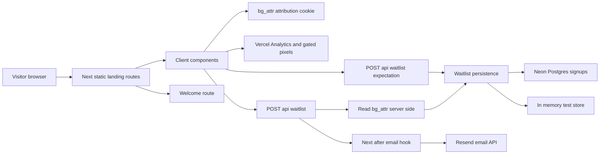
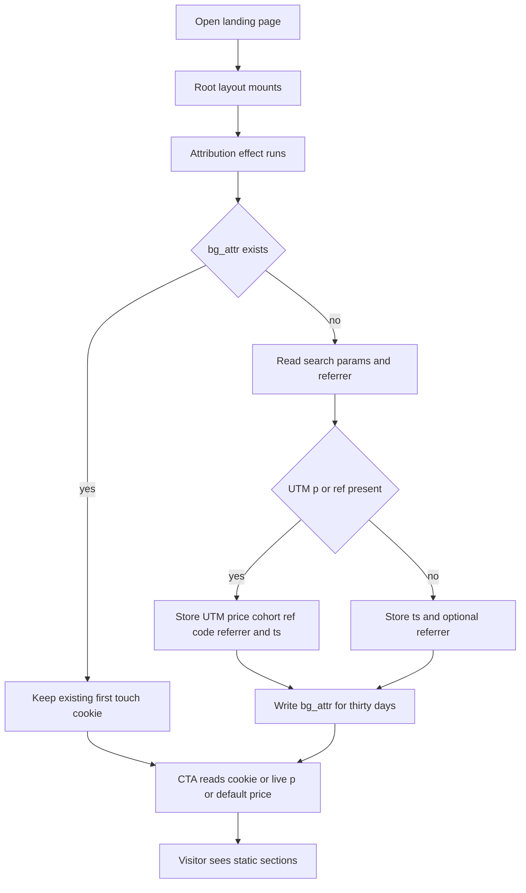
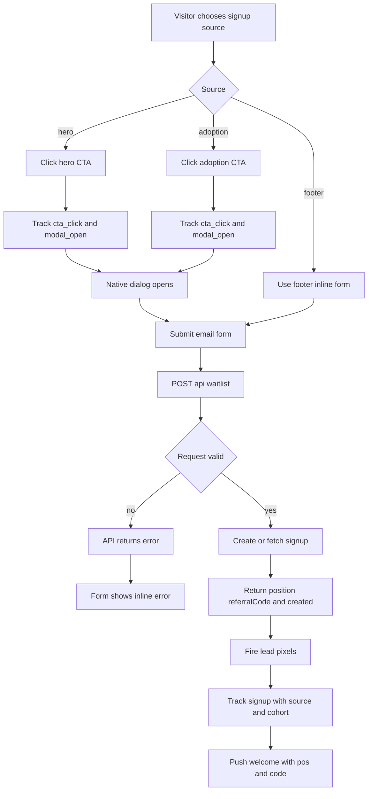
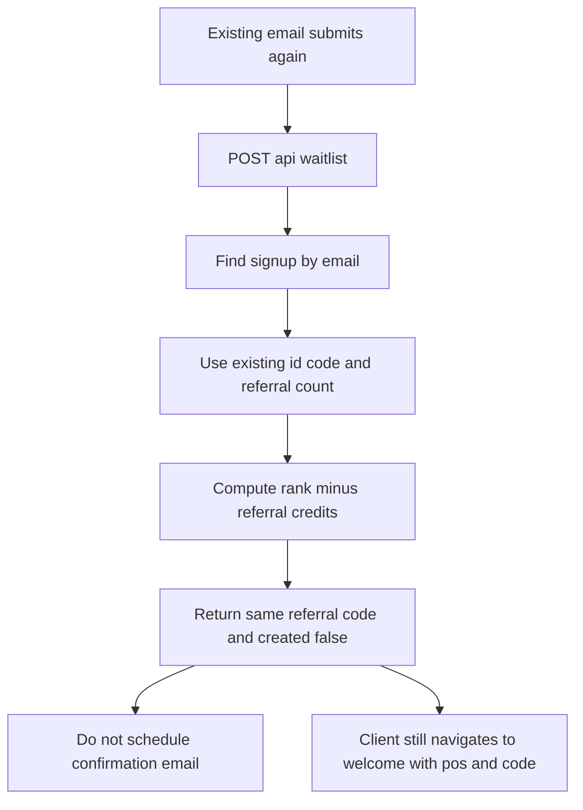
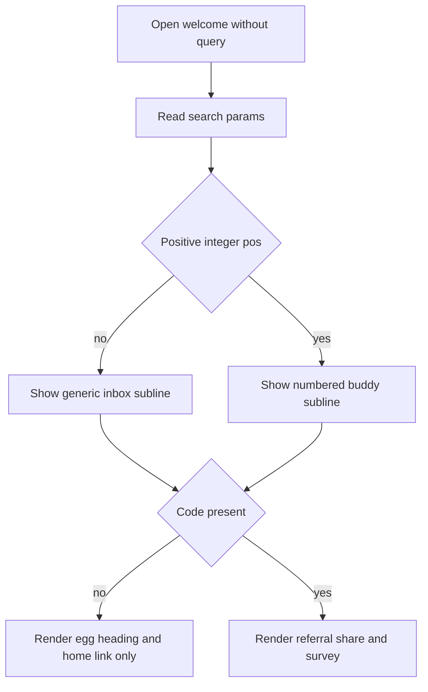
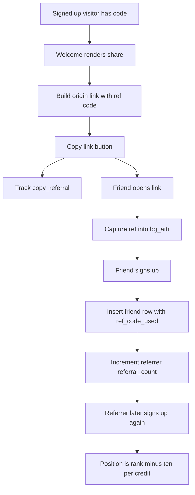
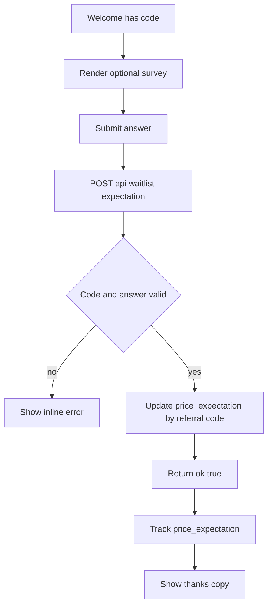
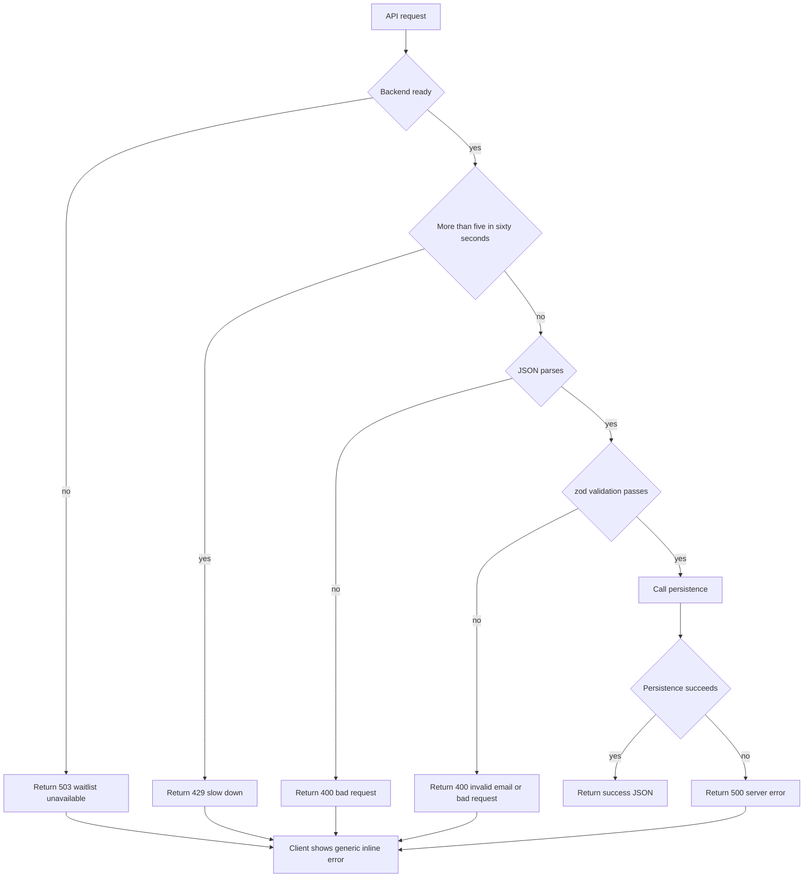
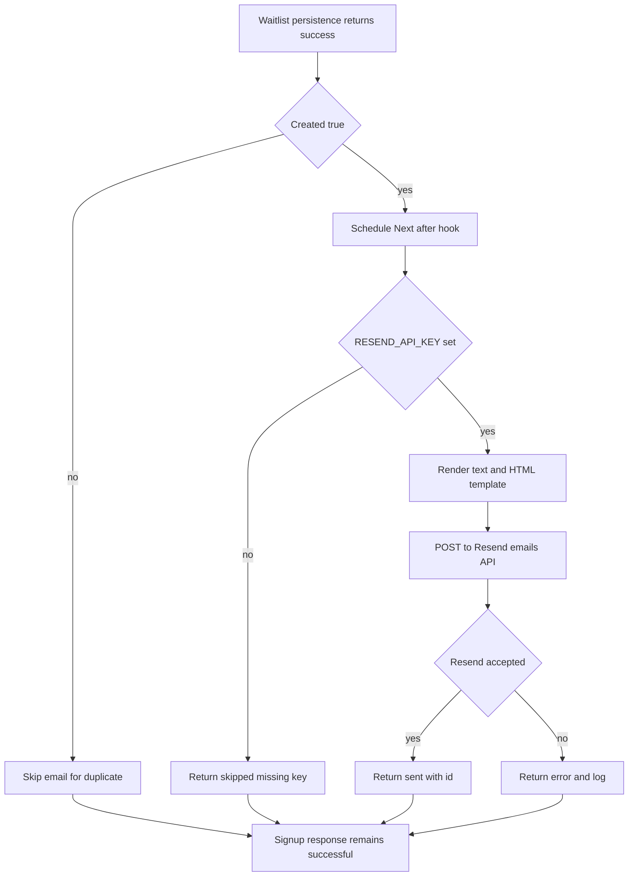

# Boop Landing Architecture

This document describes the landing page that exists in `landing/`. The code is the source of truth. `landing/SPEC.md` and `landing/README.md` explain intent and setup, but where they differ from implementation this document calls that out explicitly.

The landing page is independent from the Swift macOS app and ESP32 firmware. Nothing under `landing/` imports from `app/` or `firmware/`.

## System View



## Stack

The stack is deliberately small and Vercel-native: static marketing pages stay fast, the two server routes own the only mutation paths, and the one-table database does not need an ORM or service layer.

- Next.js 15 App Router with TypeScript: `landing/src/app` defines static pages, dynamic API routes, metadata, and the root layout. The app is static-first; only the waitlist APIs are forced dynamic.
- React 19 client components: small browser-only islands handle attribution, modal state, forms, clipboard, analytics, and scroll observation.
- Tailwind CSS v4: `landing/src/styles/globals.css` defines the product color tokens, font token, motion easing, reveal classes, dialog animation, and reduced-motion behavior. There is no component library.
- Geist Sans: imported in `layout.tsx` and exposed through `--font-geist-sans`.
- Neon serverless Postgres: `@neondatabase/serverless` is used directly from `landing/src/lib/waitlist.ts`; there is no ORM.
- zod: API request validation for both waitlist endpoints.
- Vercel Analytics: mounted globally through `@vercel/analytics/next` and used for custom events through `track`.
- Resend: confirmation email delivery through a direct `fetch` call to `https://api.resend.com/emails`.
- Node scripts: schema push, email template embedding, and email test-send live under `landing/scripts`.
- Tests: Node built-in `node --test` for unit checks and Playwright for one end-to-end signup path.

## Project Layout

- `landing/src/app/layout.tsx`: root metadata, JSON-LD, Geist font, global `Attribution`, `ScrollDepth`, `Pixels`, and Vercel `Analytics`.
- `landing/src/app/page.tsx`: section composition for S1 through S8.
- `landing/src/app/welcome/page.tsx`: post-signup page. It accepts `pos` and `code` query params, renders generic copy without them, and renders referral share plus the price survey only when `code` is present.
- `landing/src/app/privacy/page.tsx`: plain privacy page.
- `landing/src/app/api/waitlist/route.ts`: `POST /api/waitlist`.
- `landing/src/app/api/waitlist/expectation/route.ts`: `POST /api/waitlist/expectation`.
- `landing/src/components/sections`: one component per section: `Hero`, `Moment`, `Alive`, `LightLanguage`, `RationalFloor`, `Adoption`, `Faq`, `Footer`.
- `landing/src/components`: shared primitives and client islands such as `WaitlistCTA`, `EmailForm`, `WelcomeShare`, `WelcomeSurvey`, `Attribution`, `Pixels`, `ScrollDepth`, `Reveal`, `Media`, and `BuddyBlob`.
- `landing/src/lib`: copy, attribution, waitlist persistence, email rendering and sending, pixels, JSON-LD serialization, submit helper, and UI classes.
- `landing/db/schema.sql`: the production Postgres schema.
- `landing/scripts`: `db-push.mjs`, `emails-build.mjs`, and `email-send-test.mjs`.
- `landing/tests`: Node unit tests for copy rules and email rules.
- `landing/e2e`: Playwright waitlist flow.
- `emails/`: canonical email Markdown templates. They are embedded into `landing/src/lib/email-templates.ts` by `npm run emails:build` because the Vercel project root is `landing/`.

## Routes

- `/`: static landing page composed from S1 through S8.
- `/welcome`: post-signup page. `pos` controls the numbered subline when it is a positive integer. `code` controls whether referral sharing and the survey render.
- `/privacy`: privacy copy from `copy.privacy`.
- `POST /api/waitlist`: waitlist signup endpoint.
- `POST /api/waitlist/expectation`: optional price-expectation survey endpoint.

Both API routes export `runtime = "nodejs"` and `dynamic = "force-dynamic"`.

## Page Structure

S1 `Hero` is full viewport height with `/media/hero.jpg` as a swap-in asset and an SVG placeholder from `MediaImage` when the file is absent. It contains the hero CTA with source `hero`.

S2 `Moment` is three drawn beats using `BuddyBlob`: asks, pet, back to work.

S3 `Alive` is three drawn and animated vignettes: wobble, sleep peek, celebration.

S4 `LightLanguage` is a full-width night band with five faceless glow states: Working, Needs you, Done, Stuck, Asleep.

S5 `RationalFloor` is compatibility text for Claude Code, Codex, Cursor, and VS Code plus three trust lines.

S6 `Adoption` shows the adoption box with `/media/box.jpg` as a swap-in asset and an inline SVG placeholder. It includes the mid-page CTA with source `adoption`.

S7 `Faq` renders FAQ text and FAQPage JSON-LD.

S8 `Footer` renders the inline footer signup with source `footer`, optional follow-the-build link when `copy.footer.followBuild.url` is non-empty, `/privacy`, `mailto:hello@adoptaboop.com`, signoff, and wordmark.

## Attribution

`landing/src/lib/attribution.ts` owns first-touch attribution.

- Cookie name: `bg_attr`.
- Cookie lifetime: 30 days.
- Cookie attributes: `path=/` and `SameSite=Lax`.
- First-touch behavior: if `bg_attr` already exists, `captureAttribution` returns without changing it.
- Captured query params: `utm_source`, `utm_medium`, `utm_campaign`, `utm_content`, `utm_term`, `p`, and `ref`.
- Captured browser value: `document.referrer`, when present.
- Captured timestamp: `ts`, set to `new Date().toISOString()`.
- Stored price key: `priceCohort`.
- Stored referral key: `ref_code_used`.
- Valid price cohorts: `99` and `129`.
- Default displayed price: `119`.

The root layout mounts `<Attribution />`, which calls `captureAttribution` in a client `useEffect`. `WaitlistCTA` hydrates its displayed price after mount using `getPriceCohort`: stored cookie cohort first, live `?p=` second, then default `119`. The server API reads `bg_attr` from `next/headers` cookies and parses it as JSON. A malformed cookie is ignored and signup proceeds with empty attribution.

## Waitlist API

`POST /api/waitlist` accepts:

```json
{ "email": "person@example.com", "source": "hero" }
```

The actual `source` enum is `hero`, `adoption`, or `footer`.

Processing order:

1. `isBackendReady()` checks whether `DATABASE_URL` is set or `ALLOW_INMEM=1`. If neither is true, the API returns status `503` with `{ "error": "waitlist unavailable" }`.
2. A per-process and per-route IP limiter reads the first `x-forwarded-for` address or uses `local`. It keeps timestamps for the last `60_000` ms and rejects the sixth request in that window with status `429` and `{ "error": "slow down" }`.
3. JSON parse errors return status `400` with `{ "error": "bad request" }`.
4. zod validates `email` as an email string with max length `320` and validates `source`. Validation failures return status `400` with `{ "error": "invalid email" }`.
5. The email is normalized with `trim().toLowerCase()`.
6. The API reads and parses the `bg_attr` cookie.
7. `submitSignup` inserts or fetches the signup.
8. If `result.created` is true, `after()` schedules `sendWaitlistConfirmation`. Email delivery is not awaited by the response.
9. The response JSON is the full `SubmitResult`: `{ "position": number, "referralCode": string, "created": boolean }`.
10. Persistence exceptions are logged and return status `500` with `{ "error": "server error" }`.

Client behavior is deliberately simple. `submitEmail` throws for any non-OK response. `EmailForm` catches all failures and shows `copy.modal.error`, so validation errors, rate-limit errors, 503 backend-not-ready errors, and 500 persistence errors all look the same in the UI.

### Idempotency

Idempotency is by unique `email`.

Postgres path:

- First, select `id`, `referral_code`, and `referral_count` by email.
- If a row exists, compute rank as `count(*) where id <= row.id`.
- Return the existing `referral_code`, computed position, and `created: false`.
- Do not update attribution, source, price cohort, or referral credit on duplicate signup.

In-memory path:

- Find by email.
- Rank by count of rows with `created_at <= existing.created_at`.
- Return existing code, computed position, and `created: false`.

### Referral Crediting

New signups receive an eight-character referral code generated from the Crockford alphabet:

```text
0123456789ABCDEFGHJKMNPQRSTVWXYZ
```

If attribution includes `ref_code_used`, the Postgres path inserts the new row and then runs:

```sql
update signups set referral_count = referral_count + 1
where referral_code = ${attr.ref_code_used}
```

The in-memory path increments the matching referrer if one exists. Invalid referral codes do not block signup and do not create credit. The Postgres code does not wrap the insert and referrer update in an explicit transaction.

### Position Math

`positionFrom(rank, referralCount)` is:

```ts
Math.max(1, rank - 10 * referralCount)
```

For a new signup, the returned position is `Math.max(1, rank)` because the new row starts with `referral_count = 0`. For duplicate signups, the returned position reflects the current referral count discount. Rank is based on monotonic `id` in Postgres, not `created_at`, because the code comment notes timestamp precision issues after JS serialization.

### Backend Modes

- Production mode: `DATABASE_URL` set, Neon serverless SQL used.
- Test fallback: `ALLOW_INMEM=1` and no `DATABASE_URL`, global in-memory array used.
- Not configured: no `DATABASE_URL` and no `ALLOW_INMEM`, both API routes return `503`.
- Database failure with `DATABASE_URL` set: exceptions from Neon return `500`.

## Price Expectation API

`POST /api/waitlist/expectation` accepts:

```json
{ "code": "ABC12345", "answer": "$119" }
```

Validation:

- `code`: trimmed string, min length `1`, max length `32`.
- `answer`: trimmed string, min length `1`, max length `64`.

Behavior:

- Same backend readiness check as the signup route.
- Same per-route in-memory IP limiter as the signup route.
- JSON parse errors return `400` with `{ "error": "bad request" }`.
- zod validation failures return `400` with `{ "error": "bad request" }`.
- Success updates `price_expectation` where `referral_code = code` and returns `{ "ok": true }`.
- Unknown codes still return `{ "ok": true }` because the SQL update can affect zero rows without error.
- Persistence exceptions return status `500` with `{ "error": "server error" }`.

`WelcomeSurvey` only renders when `/welcome` has a `code` query param. On success it tracks `price_expectation` and swaps the form for the thank-you copy. Any non-OK response shows the same inline error as the signup form.

## Database Schema

The single table is `signups`.

- `id bigint generated always as identity primary key`: monotonic server-side identity. Used for position rank and primary key identity.
- `email text not null unique`: contactability field and idempotency key. Duplicate submissions fetch this row instead of creating a new signup.
- `source text not null`: signup source for funnel analysis. Actual code writes `hero`, `adoption`, or `footer`; the schema comment only mentions `hero` and `footer`.
- `price_cohort integer`: captured price cohort from first-touch `p`. Code stores `99`, `129`, or `null`; default displayed price `119` is not stored unless passed as an attribution cohort, which cannot happen with current validation.
- `utm_source text`: first-touch UTM source.
- `utm_medium text`: first-touch UTM medium.
- `utm_campaign text`: first-touch UTM campaign.
- `utm_content text`: first-touch UTM content.
- `utm_term text`: first-touch UTM term.
- `referrer text`: first-touch `document.referrer`.
- `ref_code_used text`: referral code from first-touch `?ref=`.
- `referral_code text not null unique`: this signup's own share code.
- `referral_count integer not null default 0`: number of credited referred signups. Each credit moves computed position up by ten slots, floored at one.
- `price_expectation text`: optional survey answer from `/welcome`.
- `created_at timestamptz not null default now()`: signup timestamp. Indexed, but current position rank uses `id`.

Indexes:

- `signups_created_at_idx` on `created_at`.
- `signups_referral_code_idx` on `referral_code`.

The schema also includes `alter table signups add column if not exists price_expectation text;` for older databases.

## Analytics and Pixels

Global analytics:

- `<Analytics />` from Vercel is mounted in `layout.tsx`.
- `ScrollDepth` observes every element with `data-section` and tracks `scroll_depth` once per section at threshold `0.5`.

Custom Vercel events:

- `scroll_depth` with `{ section }`, where section is `S1` through `S8`.
- `cta_click` with `{ source, price }`, fired by hero and adoption CTA buttons.
- `modal_open` with `{ source, price }`, fired by hero and adoption CTA buttons.
- `signup` with `{ source, cohort }`, fired after a successful waitlist response.
- `copy_referral` with `{}`, fired after clipboard write succeeds.
- `price_expectation` with `{}`, fired after the survey API returns OK.

Ad pixel environment variables:

- `NEXT_PUBLIC_REDDIT_PIXEL_ID`
- `NEXT_PUBLIC_TWITTER_PIXEL_ID`
- `NEXT_PUBLIC_META_PIXEL_ID`

`Pixels` renders no scripts unless the corresponding env var is set. With no IDs, local and preview pages load zero third-party pixel bytes. When enabled:

- Reddit script initializes `rdt`, tracks `PageVisit` on load, and `fireLead` tracks `SignUp`.
- Twitter script initializes `twq`, and `fireLead` sends event `signup` with `{ source }`.
- Meta script initializes `fbq`, tracks `PageView` on load, and `fireLead` tracks `Lead` with `{ source }`.

`fireLead` catches and ignores all pixel errors so analytics cannot break signup.

## Email Pipeline

Canonical template:

- Source file: `emails/waitlist-confirmation.md`.
- Generated embed: `landing/src/lib/email-templates.ts`.
- Build command: `cd landing && npm run emails:build`.
- Sync check: `landing/tests/email-rules.test.mjs` runs `emails-build.mjs --check`.

The Markdown frontmatter fields are `id`, `subject`, `from`, `replyTo`, `trigger`, `placeholders`, `heading`, and `subline`. The generated `WAITLIST_CONFIRMATION_TEMPLATE` is used by `landing/src/lib/email.ts`.

Rendering:

- Placeholders: `{{position}}` and `{{price}}`.
- Plain text: heading, subline, and body.
- HTML: inline-styled cream and charcoal layout, one amber accent, escaped text, signoff styled as a quiet footer, and `adoptaboop.com` linkified.
- No images and no tracking pixel.

Sending:

- `sendWaitlistConfirmation` reads `RESEND_API_KEY`.
- If the key is missing, it logs a debug message and returns `{ status: "skipped", reason: "RESEND_API_KEY is not set" }`.
- If the key exists, it sends `from`, `reply_to`, `to`, `subject`, `text`, and `html` to `https://api.resend.com/emails`.
- Resend non-OK responses and thrown exceptions are logged and returned as `{ status: "error", error }`.
- The waitlist API schedules the send in `after()` only when `created` is true. Duplicate email submissions do not send another confirmation.
- Send failures and skipped sends are fail-open with respect to signup; the API response has already been returned.

Test-send:

- `cd landing && npm run email:test -- you@example.com`
- The script loads `landing/.env.local`, imports `sendWaitlistConfirmation`, and sends a sample with position `42` and price `119`.
- A skipped send is treated as a script failure because it is a send test, not an application signup path.

## User Flows

### First Visit With Or Without Attribution



### Hero Adoption And Footer Signup



### Duplicate Email Idempotency



### Welcome Direct Visit Without Params



### Referral Share And Crediting



### Price Expectation Survey



### Rate Limit And Backend Error States



### Confirmation Email Delivery



## Deployment

The deployment target is Vercel with project root directory `landing`.

Production env vars used by application code:

- `DATABASE_URL`: enables Neon Postgres persistence.
- `RESEND_API_KEY`: enables Resend confirmation email sending.
- `NEXT_PUBLIC_SITE_URL`: controls metadata and JSON-LD base URL. Defaults to `https://adoptaboop.com`.
- `NEXT_PUBLIC_REDDIT_PIXEL_ID`: enables Reddit pixel script.
- `NEXT_PUBLIC_TWITTER_PIXEL_ID`: enables Twitter pixel script.
- `NEXT_PUBLIC_META_PIXEL_ID`: enables Meta pixel script.

Test and local tooling env vars:

- `ALLOW_INMEM=1`: enables the in-memory waitlist backend when `DATABASE_URL` is absent.
- `PORT`: Playwright server port, default `3000`.
- `PLAYWRIGHT_REUSE_SERVER=1`: forces Playwright to reuse an existing server.
- `CI`: affects Playwright server reuse behavior.

Domains are expected to be `adoptaboop.com` with `www` redirected to the apex. The code default for metadata and email links is `https://adoptaboop.com`.

`landing/vercel.json` currently contains only the Vercel schema URL. It does not currently implement the README and SPEC note about `ignoreCommand` for skipping app-only pushes.

## Testing

From `landing/`:

- `npm run lint`: ESLint with `--max-warnings=0`.
- `npm run typecheck`: `tsc --noEmit`.
- `npm test`: `node --test tests/*.mjs`.
- `npm run test:e2e`: Playwright.
- `npm run build`: Next production build.
- `npm run db:push`: applies `db/schema.sql` to `DATABASE_URL`.
- `npm run emails:build`: regenerates `src/lib/email-templates.ts` from `../emails`.
- `npm run email:test -- you@example.com`: sends a rendered sample confirmation through Resend.

Current unit tests:

- `copy-rules.test.mjs`: scans string literals in `src/lib/copy.ts` for banned hype words and exclamation marks.
- `email-rules.test.mjs`: scans Markdown email templates for site brand-law violations, bans em dashes in emails, verifies generated template sync, and asserts the confirmation renderer has clean placeholders, no images, highlighted buddy number, and linked domain.

Current Playwright coverage:

- Starts `next dev` on `127.0.0.1` with `ALLOW_INMEM=1` and empty `DATABASE_URL`.
- Visits `/?p=99&utm_source=test&utm_campaign=e2e`.
- Verifies the hero CTA shows `$99`.
- Opens the hero modal, submits a unique email, lands on `/welcome`.
- Verifies a referral link exists.
- Submits the optional price expectation survey and verifies the thank-you copy.

## Spec Versus Code Notes

- The live signup source enum is `hero`, `adoption`, and `footer`. Older spec and schema comments mention only `hero` and `footer`.
- The live page uses S6 `Adoption`, `/media/hero.jpg`, and `/media/box.jpg`. Older spec sections mention video loops and an exploded craft render; later SPEC amendments match the current asset-light design.
- The live code implements Resend confirmation email for first successful signup. Older SPEC text says email sending is deferred, while `emails/README.md` and the implementation treat the waitlist confirmation as live.
- The SPEC says referral crediting should happen in the same transaction. The Postgres implementation inserts the new signup and then runs a separate update for the referrer.
- `landing/README.md` and SPEC mention `vercel.json` `ignoreCommand`, but the actual `landing/vercel.json` only contains `$schema`.
- SPEC deployment text mentions `NEXT_PUBLIC_SHOW_COUNTER` and `.env.example`; there is no current code reference to `NEXT_PUBLIC_SHOW_COUNTER`, and no `.env.example` file exists in the current landing file list.
