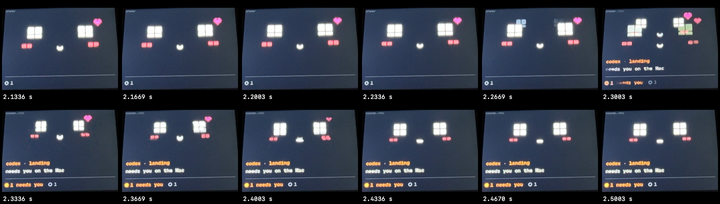
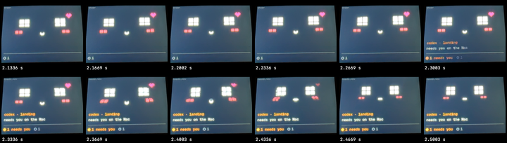
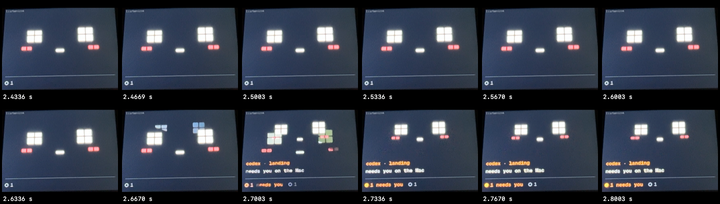
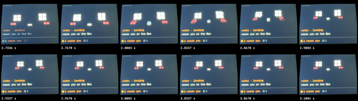
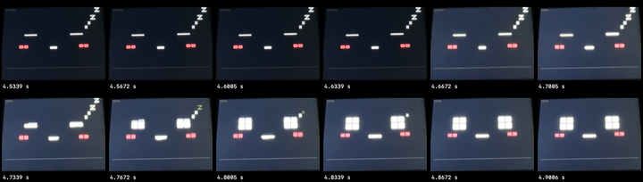
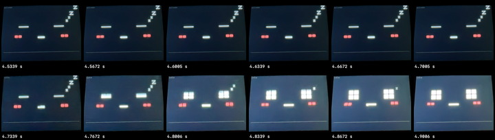
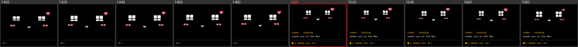
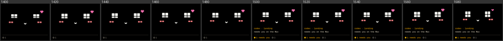

# End-to-end test and hardening, 2026-09-26

The owner asked for an exhaustive end-to-end test of Boop with every tool
(unit tests, simulator, board, pipeline, webcam), to find bugs and glitchy
animations, and to fix the core architecture rather than leaf behaviours.
The webcam was authorised for this session, with the board placed flat in
front of the MacBook camera, USB-C to the right.

The board started on firmware `c18339f` (before the minimal cut) and was
flashed with this checkout: first `9bb8004`, then the fixes below
(`9bb8004-dirty`, uncommitted at the time of the runs).

## What was found and fixed

| # | Problem | How it was found | Fix | Pinned by |
| --- | --- | --- | --- | --- |
| 1 | The face cut hard when the Mac changed something mid-animation. "Needs you" arriving under a cheer or `listening` jumped the face 30 px in one frame; so did "needs you" clearing during `listening`, the working count crossing 3, and one mumble replacing another (the mouth snapped). 317 of 2,184 state × animation × event combinations cut hard | A frame-by-frame sweep of 40 transitions in the simulator at 20 ms steps flagged 30–39 px single-frame jumps. The webcam showed the same jump on the panel, with the old and new faces ghosting together | The face follows a source that holds everything its pose depends on (look, working pace, the needs-you raise, the mumble's timing), and every change goes through one path that starts the blend from the frame that was showing (`Behaviour::change`, firmware/src/app/behaviour.h) | `test_no_change_ever_cuts_hard` (all 2,184 combinations: 317 fail on the old code, 0 now) and `test_changes_mid_motion_blend_from_what_was_showing` |
| 2 | The backlight stepped from 60 to 255 in one frame on waking while the face took 150 ms | Webcam, asleep → idle | The backlight eases over the same 150 ms, from the level showing | `test_no_app_at_30s_looks_asleep_and_reconnect_blinks`, `base.jsonl` |
| 3 | "No app" would end after 24.8 days of silence (the clock's differences wrap) and show the last state again | Reading `Behaviour::noApp` | Latched until the next `state` | `test_no_app_holds_for_weeks` |
| 4 | The brain's held mumbles were all sent at once when the rule moment ended, so only the last showed, and a brain mumble that wasn't held cut off an earlier one | Code audit of `Runtime.flushHeld` | `MomentSchedule` (app/BoopKit/App): rules play at once; the brain's moments take turns behind the rules' and each other's, and one that waited past its 5 s `ttl` is dropped | `testBrainMomentsTakeTurns`, L4's ordering check |
| 5 | A bridge client that stopped reading froze `boopctl bridge` (a blocking `sendall`), and the app's USB write then blocked its main queue forever: no hooks, ticks or brain | Code audit; reproduced on the board: with one client that never reads, a screenshot and a later `dbg.ping` both time out on the old bridge | The bridge gives each client its own outgoing buffer and drops one that falls 4 MB behind; the app's USB writes wait at most 250 ms, and a dropped link waits 1 s before reconnecting | The same test passes on the new bridge (3 screenshots, ping 0.02 s, the stuck client dropped); `testAUSBBridgeThatStopsReadingCantFreezeTheApp` hangs without the timeout |
| 6 | Bluetooth writes ignored CoreBluetooth's flow control, so a burst (a `state`, a cheer and a mumble) could drop part of a line | Code audit of `BLETransport.send` | An outbox that writes only while `canSendWriteWithoutResponse`, resumes in `peripheralIsReady`, keeps lines whole, lets a newer `state` replace a waiting one, and drops the oldest unstarted lines past 4 KB | `testBluetoothOutboxKeepsLinesWholeAndStatesFresh`. Not run on Bluetooth: agents can't launch the app with it (morning checklist) |
| 7 | A Claude turn interrupted with Esc stayed "working" (face and chatter) for up to an hour: Claude sends no `Stop` for it | Code audit of the adapter | A new event, `turn_stopped`, from an interrupted tool call or Claude's `idle_prompt`: a working session goes idle with no reaction. The interrupt still clears a waiting request, as any event does; the idle notice leaves it | `testAnInterruptedTurnGoesIdleQuietly`, `testClaudeMapping` |
| 8 | A waiting new day was replaced by the next agent input, losing that day's reflection, and a reflection cut off by talking was lost | Code audit of `Harness.submit` | A new day waits apart and is never replaced; a cancelled reflection runs again after the reply | `testANewDayIsNeverLost` |
| 9 | Taps don't move the transcript's window, so a burst of them could crowd Apple's 8K context and make the writer fail | Code audit | At most 8 asides follow an input | `testABurstOfAsidesIsCapped` |
| 10 | Push-to-talk pressed again within 1.5 s of letting go recorded nothing, and the first recording's timer could cut the next short | Code audit of `SpeechListener` | A session counter; a new recording hands the last one's words over first | Not unit-testable without the mic (morning checklist) |
| 11 | Small crash risks: `now - Int64.min` in the device link's keepalive before the first `state`; `FileHandle.write` raising an Objective-C exception on a full disk; the menu bar reading memory on the main thread while the runtime could be writing it; `BLETransport.name` reading `peripheral` off its queue | Code audit | Optional `lastSentAt`; the throwing write; read before `start()`; the name kept under a lock | Existing tests; TSan run below |
| 12 | The board lost lines in bursts: it handled one line per loop pass and drew a frame between lines (up to 31 ms), so its 2 KB receive buffers overflowed. 3 of 40 back-to-back `state` lines were lost, 74 of 300 at 200 a second, 236 of 300 at full speed | The stress run: a `dbg.press` after 80 quick messages never got its reply. Measured with the board's own `rx.state` count | The loop handles every waiting line (up to 8 ms) and then draws once; a debug message ends the batch, so tests still see injected input and clock steps between frames exactly as the simulator does | After: 40 of 40 and 300 of 300 arrive. A sustained flood at the full 460800 baud still loses lines (177 of 300), about ten times what the app ever sends. L2 stays pixel-identical |
| 13 | `Boop --snapshots` hung: the settings pane read Jev's key from the real Keychain on the main thread, and an unsigned build makes macOS ask for access, so it waited forever. The menu-bar app froze the same way while that prompt was up | The snapshot check stalled after 7 of 30 pictures; `sample` showed the main thread in `SecItemCopyMatching` | Settings reads the key through the model, off the main thread; snapshots never touch the Keychain | All 30 snapshots in 9.6 s; the settings pane looked at |

The code audit of the Mac side was done by a sub-agent and every finding
above was re-read and confirmed in the code before it was changed.

## Checks (all run 2026-09-26)

| Check | Result |
| --- | --- |
| L0 Swift, `make test` | `✓ 200 passed, 0 skipped of 200 tests` (194 before) |
| L0 Swift under Thread Sanitizer (`swift build -Xswiftc -sanitize=thread`, separate build directory) | 200 passed, no ThreadSanitizer warnings |
| L0 firmware, `make fw-test` | 111 test cases pass, in 6 suites |
| Harness evals, `make eval` | 8/8 |
| `make webcam-test` | 3 tests OK |
| Device code under ASan + UBSan | The simulator built with `-fsanitize=address,undefined` took 60,000 fuzzed lines (random states and moments, clock jumps across 2³², taps, touches off screen, shots, resets, malformed and byte-mutated JSON, 600-byte lines): no errors |
| L1, `tools/boopctl sim` | `10 scenarios, 0 expect failures, 0 new or changed pictures` |
| Simulator motion sweep (40 transitions, 20 ms steps) | Before: 30–39 px single-frame jumps in two cases. After: at most 12 px (a cheer's hop while the face rises for a bubble); the rest is the "zzZZ" letters appearing, by design |
| L2, `tools/boopctl run` | Before and after the fixes: `10 scenarios, 0 expect failures, 0 pictures differ from the simulator` |
| L2, `boopctl perf --motion` | 20–30 s: minimum 129–138 fps, mean 154–156, heap minimum 74.0 KB, no reset |
| L3, `boopctl cam frame` | Screen found |
| L3, `boopctl cam pattern` | Fails at full backlight only because the camera clips (green reads 250, 250, 206); at backlight 40 every check passes: red, green, blue, amber, white over black, UP at the top, the USB-C bar on the right |
| L3, clips (30 fps, video only, raw footage deleted) | Working, cheer, needs you, tap and asleep look right. Before the fix, "needs you" under a cheer or `listening` jumped in one frame; after, it eases over about five frames (pictures below) |
| L4, `tools/boopctl e2e` | PASS, four runs: hook → device p50 41–55 ms, p95 56–81 ms before fix 12 (load average up to 10 on the Mac), and p50 37 ms, p95 46 ms on the final build and firmware; brain moments 4, none early |
| L4 soak, `e2e --soak 10` | PASS: 11.6 min, 13 rounds, 338 hooks, 0 checkpoint misses, no link glitches, no board reset, heap minimum drift 0 (73,956 B), no audio errors, the app at 22–50 MB and alive, and the plain face at the end. Hook → device p50 48.5 ms, p95 78.2 ms over 147 |
| Device stress on the board (a 600-message flood, malformed JSON, out-of-range fields, 200-character names, 600-byte lines, 3 KB with no newline, bursts mixed with taps, touches and screenshots) | Before fix 12: a reply lost after a burst. After: PASS, no reset, heap minimum 73,820 B, and the right face at the end |
| App snapshots, `Boop --snapshots` | Before fix 13: hung after 7. After: 30 pictures; settings looked at, nothing clipped |

## Pictures

"Needs you" arriving mid-cheer, on the panel (30 fps camera, consecutive
frames). Before, 2.27–2.30 s: the face jumps up in one frame and both faces
show at once.

After: the text appears with the face where it was, and the face eases up
over 2.33–2.47 s.

The same for `listening`, before (2.67–2.70 s) and after (2.73–2.90 s):

Waking from asleep: before, the backlight jumps at 4.67 s while the eyes
are still shut; after, it rises with them.

The simulator, frames 1400–1780 ms, "needs you" at 1500 ms mid-cheer,
before and after:

## Seen but not changed

- **Shear during fast moves.** While the face moves quickly (a blend, a
  cheer's hop), camera frames show it sheared diagonally. The panel has no
  tear-effect sync and, in landscape, its scan runs across the canvas rows
  the firmware writes; the camera's rolling shutter does the same thing, and
  a 30 fps camera can't tell them apart. If it shows to the eye, the fixes
  are a faster SPI clock (40 MHz now, 80 possible on these pins) or pushing
  in the panel's own row order. Tracked in [PLAN.md](../../PLAN.md) §7.
- **The pixel grid steps.** Blends move in 3 px blocks and eyes grow in
  two-block steps (odd sizes keep them centred), so a 150 ms blend is a
  handful of visible steps. That is the pixel style, not a bug.
- **The working shiver** (±2 px at 11 Hz during the strain) snaps to the
  block grid and wasn't visible on camera.
- Remaining audit items, tracked in [PLAN.md](../../PLAN.md) §7: timers use
  the wall clock, so a clock step backwards delays the keepalive; the
  adapter reads `.git` on every hook; `Runtime.projects` is never pruned.

## Tools used

The motion sweep, the webcam clip driver, the stress script and the fuzz
generator were scratch scripts for this run and aren't in the repo. The
lasting guard is `test_no_change_ever_cuts_hard`, which checks the same
property exactly, on every combination, in `make fw-test`.
