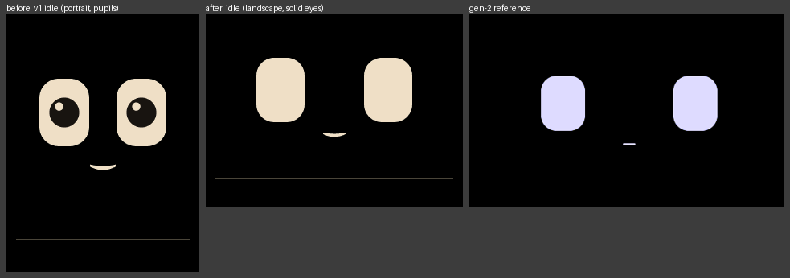

# Landscape screen and cuter eyes (F6), 2026-09-26

The owner asked for two changes to Boop's look after the v1 build:

- **Landscape.** Boop sits sideways, so the screen is now 320×240 with the
  USB-C port on the right.
- **Cuter eyes.** The v1 eyes looked too realistic, so they are now solid,
  like gen-2's. Everything is checked in the simulator, and then on the
  board over USB: the landscape build is flashed, every board screenshot
  matches its golden pixel for pixel, and it runs at 49 fps or more while
  moving. What's left is the owner's look and touch calibration.

## What changed

**The screen.** The drawing canvas is 320 wide and 240 tall (still
76.8 KB). The panel is physically 240×320, and LovyanGFX turns the picture
with one constant, `kRotation` in `firmware/src/board/display.h`. It's set
to 1, which should put USB-C on the right. If the board shows the picture
upside down, setting it to 3 turns it half a turn; USB-C stays on the right
either way, because the test pattern and the webcam check assume it. The
panel does the turning in hardware, so rows still stream in order with no
extra work per pixel. Each push band is now 12 rows, which keeps the two
buffers at 7.68 KB each.

**Layout** (tuned by looking at the rendered pictures):

- **Status strip:** the bottom 36 px.
- **Bubble:** the 60 px above the strip, only when it shows.
- **Face:** alone, it's centred in the 204 px above the strip. With a
  bubble, it eases up into the top 144 px at three-quarters size.
- **Needs you:** "agent · project" in amber, then "needs you on the Mac",
  with "+N more" in grey on the right.
- **Threads:** one row per session with an agent column. All 8 sessions fit.
- **Stats:** the progress ring on the left, and the name and days on the
  right.
- **Other screens:** the starving bowl, the strip icons, and the no-app,
  asleep and reconnect faces all fit the wide screen.
- **Test pattern:** the corner labels are right for the sideways view, and
  a black bar marks the USB-C edge.

**Touch.** Before calibration, raw touch readings are mapped in plain C++
and turned by the same `kRotation`. A saved calibration now records the
screen size and rotation it was made on, and one made for any other
setting is ignored. The portrait build's saved calibration is deleted at
start-up, so touch must be calibrated again. `boopctl calibrate` places its
crosses from the screen size the board reports.

**Eyes.** Solid rounded rectangles in the oat colour, 60 × 80 px with a
corner radius of 22, and 134 px apart (42% of the width, like gen-2). They
have no pupil, iris or highlight.

- **Looking:** the whole eye moves, 26 px sideways or 16 px up or down. The
  eye on the side being looked towards grows by up to 11% and the other
  shrinks, as if Boop turned its head.
- **Lids:** wherever a lid meets the edge of an eye, the corner is
  rounded: 8 px, or the largest radius down to 2 px that fits when a lid
  comes down low at the end of the eye or the eye is nearly shut (a yawn, a
  blink, the starving face at night). Happy eyes are crescents.
- **Eye size:** `Pose::pupil` became `Pose::eyeSize`. Curious, listening,
  needs-you, love and startled eyes are a little bigger; worried and busy
  eyes are a little smaller. Startled used to shrink its pupils; now it
  widens its eyes.
- **Thinking:** it used to roll its pupils up under the lids. Without
  pupils, lids made it the working face mirrored, so it now lifts the whole
  face and keeps the eye tops round.
- **Mouth:** a little smaller, and tucked in closer under the eyes.
- **Kept:** the glow and oops tints, and blends of 150 ms or less.

## Checks that ran

| Check | Result |
| --- | --- |
| `tools/boopctl sim --accept`, then `tools/boopctl sim` | 11 scenarios, 0 expect failures, 0 new or changed pictures. All 83 goldens are 320×240, and none is left over from an old shot name |
| Looked at every golden (10 contact sheets of 9, full size) | No clipping, overlap or unreadable text. Every moment still reads, and every eye is solid. Nothing needed fixing in this pass. [goldens-sheet.png](goldens-sheet.png) shows all 83 at half size |
| `make fw-test`, after the review fixes | 85 test cases, 85 succeeded |
| `make sim`, then `tools/boopctl sim`, after the review fixes | Builds. 4 pictures changed, as intended: `moments/thinking` and `behaviour/thinking` (the new thinking face), and `moments/yawn` (50 px) and `base/reconnect` (14 px), where only the outer lid corners got rounded. Looked at each against its old golden and accepted them; the rerun gives 11 scenarios, 0 expect failures, 0 new or changed pictures |
| `make fw`, after the review fixes | Builds. Flash 1,100,239 of 1,966,080 bytes (56.0%, so 44% is spare against the 15% minimum). Static RAM 45,980 bytes (14.0%) |
| `make test` (Swift), before the review | 166 passed, 0 skipped of 166. Not rerun: the review fixes change nothing under `app/` |
| Lid corners, a throwaway sweep (the same disk test as `test_a_lid_never_leaves_a_sharp_point`) | Every animation at 20 ms steps and every look (with night and starving) through a blink, where the eye is at least 20% open and has no happy squint: 91 of 1,865 poses had a sharp point before, 3 now. The 3 are mid-blink frames of the working face at night while starving, 26% open: the outer tip is rounded at 2 to 3 px, which is too thin for the sweep's disk, and looked round when zoomed in |
| `boopctl diff` on a portrait and a landscape picture | "76800 pixels differ; see …diff.png", exit 1, and the diff image shows the two side by side |
| `boopctl calibrate` targets, offline | Crosses at (20, 20), (300, 20), (20, 220), (300, 220) and a check cross at (160, 120) for 320×240 |
| Webcam pattern judge, offline, on the golden pattern | Passes upright, and when turned from a camera view with USB-C at the bottom. Flags the picture upside down |
| Rotation, read against the LovyanGFX source in `.pio/libdeps` (a reading, not a run) | Rotation 1 turns the picture a quarter turn clockwise on the panel. The library's own touch conversion for rotation 1 matches `app::defaultTouchCal(1)` |

### On the board (L2, over USB)

These ran after the review fixes, on the working tree as it stands (HEAD
`6a59dfe` plus the uncommitted F6 change). Before flashing, nothing held
the serial port, and the board answered `ping` with J3's portrait build
(`06014a970b`, no `w`/`h`). No webcam, and no Bluetooth from the Mac.

| Check | Result |
| --- | --- |
| `make flash` | Builds and uploads: 1,100,640 bytes written and verified, then a hard reset. Flash 1,100,239 of 1,966,080 bytes (56.0%), static RAM 45,980 bytes (14.0%). The image's SHA-256 starts `a7db5c41a237` |
| `tools/boopctl ping` after the flash | `"sha": "6a59dfee84-dirty"`, `"fw": "1.0.0"`, `"w": 320`, `"h": 240`, `"link": "none"`, `"ble": "adv"` (advertising, not connected, so nothing else was writing to the board), uptime 9.7 s. Free heap 73,892 bytes |
| `tools/boopctl run` (all 11 scenarios: base, behaviour, blend, inputs, layout, life, moments, mumble, needs_you, pattern, screens) | 0 expect failures. All 83 board screenshots are identical to the simulator's (threshold 0): "11 scenarios, 0 expect failures, 0 pictures differ from the simulator". Log: [board-run.log](board-run.log) |
| The same 83 board screenshots against the goldens, directly | 83 of 83 identical, all 320×240, none missing |
| `tools/boopctl sim`, right after | 11 scenarios, 0 expect failures, 0 new or changed pictures |
| `tools/boopctl perf --seconds 30 --motion` | Minimum **50 fps** (mean 69.7), 30 samples, no reset. Minimum free heap 72,692 bytes. F2's bar is 44 fps and the budget is 60 KB free ([DEVICE.md](../../DEVICE.md) §6). [perf-motion.json](perf-motion.json) |
| `tools/boopctl perf --seconds 60 --motion`, a second run | Minimum **49 fps** (mean 69.7), 59 samples, no reset, minimum free heap 72,692 bytes. [perf-motion-60s.json](perf-motion-60s.json) |
| Free heap against J3's build | Unchanged: J3's portrait build had 73,180 bytes free before the flash, and F5 measured a 72.5 KB minimum. The landscape build starts with 73,892 and bottoms out at 72,692 through motion, about 12.7 KB above the 60 KB target |
| `tools/boopctl pattern`, then `tools/boopctl shot` | `dbg.state` says `"screen": "pattern"`. The screenshot, [board-pattern.png](board-pattern.png), is identical to the `pattern/pattern` golden (`boopctl diff`: 0 pixels). It shows what the board drew, not which way up the panel shows it; that still needs the owner's eyes |
| Back to normal | `dbg.reset` and `boopctl clock run`, then `dbg.state` 30 s later: `"screen": "no_app"` with the clock running, the board's own face without the Mac. Nothing was left holding the serial port (`lsof` empty) |

## Review fixes

Four reviewers looked at the change the same day. What they found, and what
changed (pictures in [review-fixes.png](review-fixes.png)):

- **Sharp lid corners.** The rounding gave up when a lid met the eye's
  bottom corner, which happens when a tilted lid comes down low (the working
  face at night while starving) and in every nearly shut eye (the wide
  yawn, blinks on tilted lids). It now rounds there too, and where 8 px
  doesn't fit it uses the largest radius down to 2 px that does. A new unit
  test fails on the old code.
- **Thinking looked like working, mirrored.** Without pupils, its lids left
  the same flat-topped eyes as working, just up and to the other side. It
  now lifts the whole face with round-topped eyes, a little wider. A new
  unit test tells the two apart.
- **`kRotation` 3.** The code and DEVICE.md called it "USB-C on the left",
  but the pattern's bar and the webcam check always put USB-C on the right.
  It now means only "1 turned out upside down".
- **The checklist didn't flash the new build.** Row 2 now flashes it first
  and checks `ping`, so the pattern and calibration run on landscape
  firmware, and the owner's look at the face is a checklist step.
- **Diffs of different sizes** printed a path to a diff image that was
  never written. It is now written, with the two pictures side by side.
- **Wording:** the band size (a band is still 3,840 px; each changed row
  pushes a third more), and the decision-log row on eye size (startled now
  widens its eyes where its pupils used to shrink).

## Still needs the owner

The board checks above passed, and the board now runs the landscape build,
so the flash in morning checklist row 2 is already done (running it again
is harmless). What only a person can do:

- **Orientation (about 90% sure).** Rotation 0 had USB-C at the bottom at
  bring-up (F1), so rotation 1 puts it on the right, but nobody has seen it
  yet. With Boop sideways and USB-C on the right, run `tools/boopctl
  pattern`: the UP arrow should be at the top and the black bar on the
  USB-C side. If it's upside down (the bar on the wrong side), set
  `kRotation` to 3, `make flash`, and look again (morning checklist row 3).
- **Touch calibration.** Run `tools/boopctl calibrate` after the
  orientation is confirmed. The old portrait calibration is ignored.
- **The owner's look.** Whether the new face is cute enough on the real
  panel.

## Files here

- `before-after.png`: v1 idle (portrait, with pupils), the new idle, and the gen-2 reference
- `goldens-sheet.png`: all 83 goldens at half size
- `review-fixes.png`: thinking before and after, next to working; lid corners before and after, 4× (the review fixes)
- `before-idle-v1-portrait.png`, `after-idle.png`
- `glance.png`, `happy.png`, `sleepy.png`, `side_eye.png`
- `bubble.png` (the face raised for a mumble), `needs-you.png` (with "+1 more")
- `stats.png`, `threads.png`, `pattern.png`
- `board-pattern.png`: the test pattern as the board drew it (a USB screenshot)
- `board-run.log`: `tools/boopctl run` on the board, every scenario
- `perf-motion.json`, `perf-motion-60s.json`: `tools/boopctl perf --motion` for 30 s and 60 s
