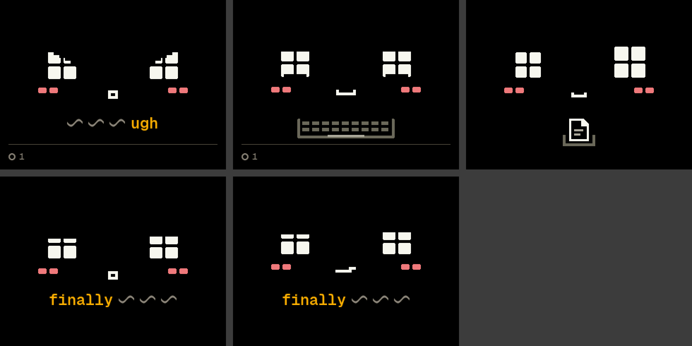

# Reaction faces

2026-09-27, on the worktree branch rebased on `main` at `8ac87a7e`. A
reaction now borrows a mood's face: `react` picks `none` or one of the
seven moods, and the moment's `mood` draws the look in that mood's design
while the mumble plays ([harness/DECISIONS.md](../../harness/DECISIONS.md)
§3, [PROTOCOL.md](../../PROTOCOL.md) §3). The designs didn't change.

## What ran, and passed

| Check | Result |
| --- | --- |
| `make build` | Builds |
| `make -C internal test` | 195 passed, 0 skipped. New or changed: the react options are `none` and the seven moods, each moment carries its face as `mood` and none plays while something needs you (`testReact`); the mood → voice map (`testEachMoodHasAVoice`); the rules' moments carry no `mood` (`testRuleMomentsCarryNoExpression`, `testChatterNeverCutsAMoment`); a brain mumble plays over the cheer but waits for a line (`testBrainMomentsTakeTurns`, `testTheBrainMumblesOverTheRulesCheer`) |
| `make -C internal fw-test` | 108 test cases passed. New: `test_an_expression_lasts_as_long_as_the_mumble`, `test_an_expression_over_the_cheer_and_across_a_look_change`, `test_an_expression_ends_with_its_moment` (`test_behaviour`), `test_a_moment_carries_its_expression` (`test_device`) |
| `make -C internal sim` | 11 scenarios, 0 expect failures, 0 changed pictures: every earlier golden is unchanged, and the new `expression` scenario's five are below |
| `make -C internal tools-test` | 25 `boopctl` tests (the dashboard's Preview now plays a reaction with its `mood`) and 3 webcam tests, OK |
| `make -C internal fw` | Builds for the board (RAM 13.9%, flash 56.0%) |

The dashboard's fixture (`internal/tools/boopctl_lib/tests/fixtures/headless-debug.jsonl`)
was brought to the new shapes: its `questions` line is a fresh one from a
headless run, and its brain moments, forced answer and react messages
were rewritten as today's app writes them (`"mood"` on the brain's
moments, `grumpy` for `annoyed`, "Boop made … face and mumbled").

## The new goldens

`internal/firmware/test/golden/expression/`, from
`internal/firmware/test/scenarios/expression.jsonl`. Top row: working in
grumpy's design while "…ugh!" plays (the state says happy); working back
in happy's design after the bubble; the rule's cheer in curious. Bottom
row: Jev's proud reaction over the same cheer, which becomes proud's cheer
with the cheer's clock carried on; and after the cheer ends, the idle look
still in proud's design until the bubble goes.

## Not run

- `make eval`: it needs the owner's Jev key. The scenarios that named
  `annoyed` now expect `grumpy` (and `sad` or `determined` where those
  faces fit), unchecked against Jev.
- Nothing on the board: no Bluetooth, USB board run or webcam.
