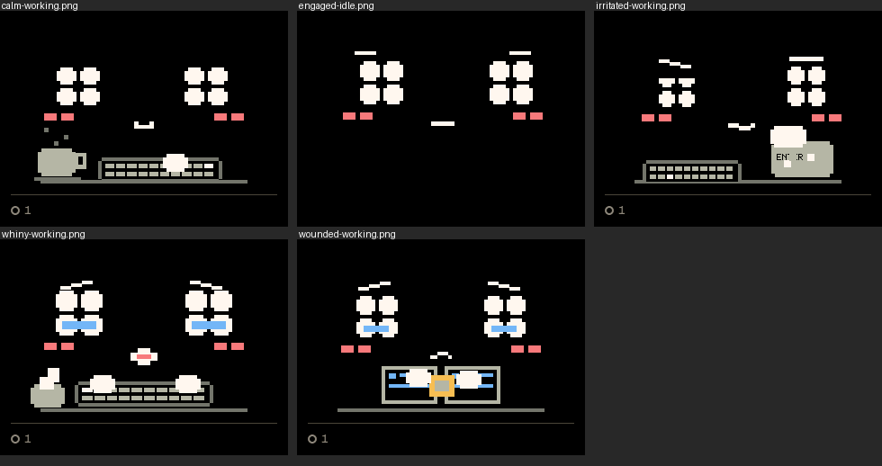
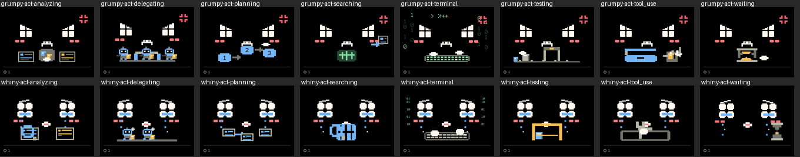
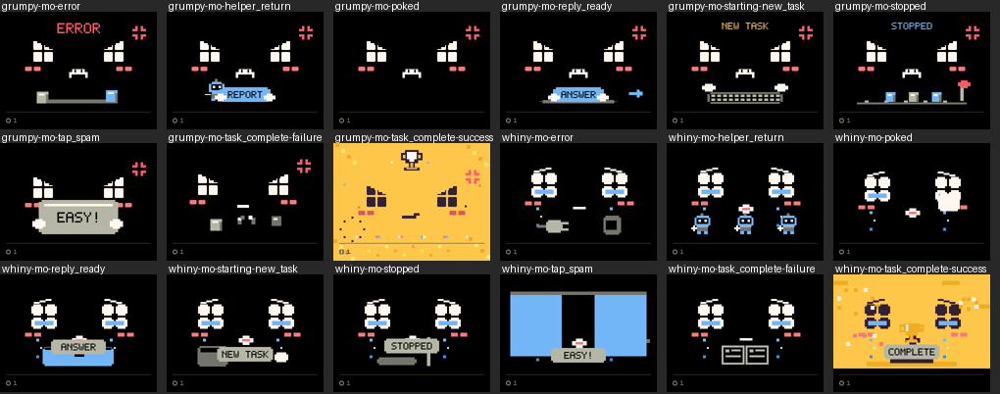

# Mood spectrum: the board (P9)

Updated 2026-09-29. The integration branch's firmware on the bench board
(`/dev/cu.usbserial-110`) over USB only, with no Bluetooth, the owner's
app not running, and no webcam in this part. The owner approved flashing over USB
for the night ([PLAN.md](../PLAN.md) §3).

## What ran

| Check | Firmware | Result |
| --- | --- | --- |
| Flash with the new partition table (`huge_app.csv`, [DEVICE.md](../../../DEVICE.md) §5) | `41b5fe9d` (art and states lanes), then `067c7d80` (all four lanes) | Both booted. 2,498,811 bytes, 79.4% of the 3 MB slot. There was no touch calibration to keep (`boopctl calibrate --show` said `null` before the first flash) |
| L2, `boopctl run`: every simulator scenario on the board | `41b5fe9d`: 11 scenarios; `067c7d80`: 14 (with `states`, `taps`, `finish`) | 0 expect failures, 0 pictures different from the simulator, both times |
| `boopctl perf --motion`, 60 s ([perf-motion.json](perf-motion.json)) | `067c7d80` | Free heap at least 71,472 B; 6.1 frames a second on average, 3 at the least; the slowest frame 21.9 ms. The average fell from 15.5 because a wiggle now plays the stepped poke designs, not a continuous sway, so fewer frames change |
| `boopctl soak --minutes 10 --vol 1` ([soak-10min.json](soak-10min.json)) | `067c7d80` | ok: no reset, no heap drift (71,472 B from first to last sample), no lost or torn lines, no audio errors, 56 brain reactions all ended: `skipped` 33 (something needed you), `done` 9, `cut (tap)` 7, `cut (moment)` 5, `cut (needs_you)` 2 |
| L4, `boopctl e2e --brain scripted`: hooks → headless app → bridge → board ([e2e-runs.txt](e2e-runs.txt)) | `067c7d80` | PASS twice after the fixture fixes below: hook to state on the device in 61–65 ms typically, 95–103 ms at the 95th percentile; 8–9 brain moments, none early, every one ended |
| Each new scene by hand (`boopctl send` a state or moment, then `boopctl shot`) | `067c7d80` | Pictures below |

## Pictures (the device's own canvas, `boopctl shot`)

The 13 moods: new ones working and idle on the board, from the first flash:

What the agents are doing (`state.act`), in an older mood (grumpy) and a
new one (whiny):

The rules' one-shots, the brain's finish and the taps, 2 s into each, in
the same two moods:

## Fixes the board runs needed

- **The L4 fixtures expected `cheer`.** The brain now plays
  `task_complete` with an outcome, so the three fixtures expect that.
  A brain moment waits its turn behind a line still playing, 5 s at most
  ([ARCHITECTURE.md](../../../ARCHITECTURE.md) §3.2), so they allow 6 s:
  after the `+400 s` clock jump the heartbeat's mumble was still playing
  in one run, and the finish came 1.2 s later.
- **The last fixture needs room for its finish to end.** A finish's
  line starts in the design's voice window, about 5 s in
  ([VOICE.md](../../../VOICE.md) §9), so its moment ends later than the
  old cheer's: `slow.jsonl` now ends with 10 s to spare, not 4.
- **Not a latency regression.** A 10 s gap between fixtures lined the
  Mac's 10 s keepalive `state` up with the next fixture's first hook,
  which e2e counted as that hook's state (about 460 ms). The gaps between
  fixtures stay 4 s.

## Seen, and worth the owner's eye

- A finish's line now starts near the end of its scene, so a brain
  reaction that comes within a second or two of a finish can wait past
  the 5 s limit and be dropped: in one e2e run the brain's mumble queued
  just before a finish was dropped that way (`react: dropped a brain
  moment that waited over 5 s`), and a prompt's `starting` one-shot is
  dropped while the finish's line plays, as the rules say.
- The poke designs of the new moods are long (up to 7.9 s) next to the
  old 0.7 s wiggle, and the average frame rate in motion is lower for the
  same reason.
- Not checked here: sound through the speaker (only that there were no
  audio errors), Bluetooth, the webcam (a later, separate pass), and
  Jev (its key ran out of credit, [evals](../evals/README.md)).
