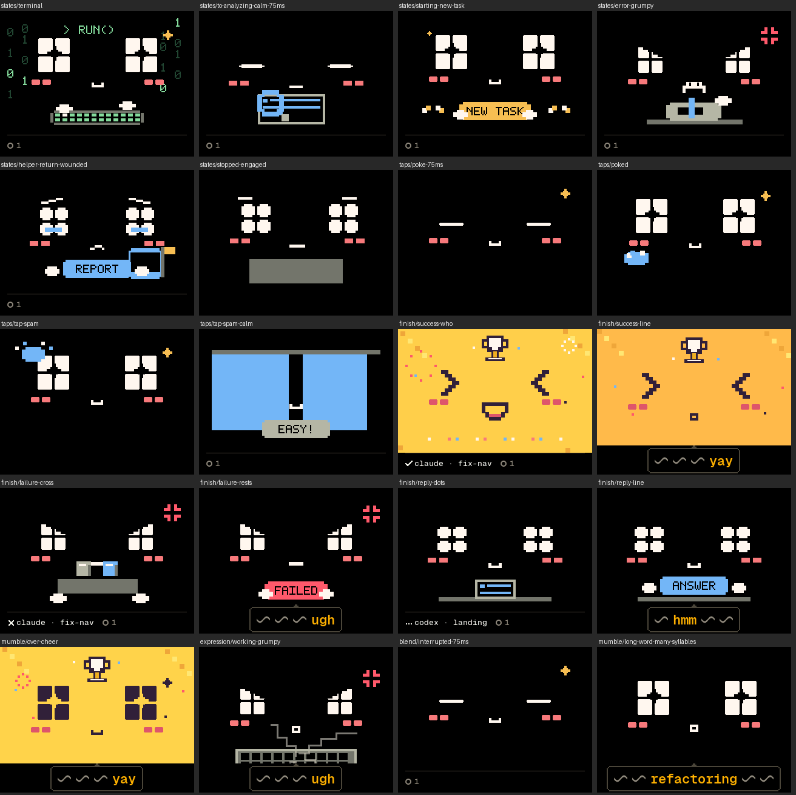

# The 22 states on the device (P5, lane device)

2026-09-29, overnight run, lane `device` (branch `ms/device`, from the
integration branch at `41b5fe9d`, with the states and art lanes merged).
Phase P5 of [the plan](../PLAN.md), and the Mac-side timing that has to
match it. No board, Bluetooth or webcam was used.

## What changed

- **What the agents are doing.** `state.act` draws that state's design
  in working's place, in the mood, from the Mac's variation; its
  variations take turns at loop ends like working's.
- **The rules' one-shots** (`starting` with `ctx`, `stopped`, `error`,
  `helper_return`) and **the brain's finish** (`task_complete` with
  `outcome`, `reply_ready`; `cheer` reads as a success) play their design
  once, or `loops` times, in the mood, then the look comes back. The
  device honours `variant` when it fits the moment's facts
  (`render::fitting`), else picks a fitting one at random, never the one
  that design showed last. A face-only brain moment plays over a
  one-shot or a poke without cutting it. The finish names whose turn in
  the strip after a mark: a tick for a success, a cross for a failure,
  three dots for a reply.
- **Listening.** Only a `say` or the empty moment ends it now. Before, any
  moment with an unknown anim and no syllables did, so a one-shot, a
  finish without a line, or a lone face ended push-to-talk's wait.
- **Taps.** A tap plays the mood's `poked` design once (the 0.7 s sway and
  heart are gone). The device counts taps in a row itself: within 3 s of
  the last, and from the third on `tap_spam` (`Behaviour::kTapRunMs`,
  `kTapSpamFrom`, the Mac's `TranscriptView` `inARowMs` and
  `answersRunFrom`). The Mac's `wiggle` reads as `poked`.
- **What shows first:** no app, listening, needs you, a poke and the
  moments, the look. With no app a tap only dips the face.
- **The voice window.** A line that comes with an animation starts at the
  design's voice window (`sfx.h` `voiceMs`); the animation holds, resting
  on its last frame, until the line and its bubble end. facegen now lists
  every design's window (its `bank.mjs` works it out by the bank's rule),
  sfxgen takes it from the manifest and checks the new moods' against the
  bank, and facegen writes it into `FaceLoops` (`voiceMs`, added; the
  rest of its API unchanged).
- **The Mac's timing.** `MomentSchedule` counts taps as the device does and
  times each by the mood's longest poked or tap_spam design;
  `DeviceMoment.playMs` times an animation by the variations the device
  may play and a line from its voice window. A new test holds every
  design's loop and window in `FaceLoops` to `faces.h` and `sfx.h`.
- **The bubble (D10)** takes the bottom lane (y ≥ 192) in the strip's
  place, boxed, with a tail; prop hiding is gone. The first pack's designs
  draw into the lane, so their props there are cut at y 192 while a line
  plays.
- **The art lane's open issues.** (a) facegen gives a flip-book's steps a
  role (`step`, `blink_step`); a change of design shows the flip-book's
  own blink step, as it shuts the first pack's eyes, so switches to and
  from the new moods no longer cut hard, and the device gives flip-books
  no blinks of its own. The "never cuts hard" tests now cover the new
  moods and what the agents are doing, and check that the shut eyes
  actually show. (b) The talking "o" sits on the mouth that shows,
  centred a pixel low, in its colour: where it always was on the first
  pack's, on the new moods' lips, and dark on a gold cheer.
- **Sounds** follow the design drawn: acts per loop, the finish, the
  one-shots and pokes once, however many loops play.
- **Tools.** `boopctl play` takes every animation, with `--variant`,
  `--outcome` and `--ctx`; perf --motion and the soak send the new set.
  The dashboard's face is cropped above the lane (y 192), so it shows the
  props. The palette drops six inks nothing drew with (the heart's and
  the hand-drawn face's), so the designs' colours start at index 48.

## Decisions made without the owner

1. **A `variant` that doesn't fit is replaced, not clamped.** One out of
   range, or for another outcome or context, reads as none: the device
   picks a fitting one, never the last. The same for listening's.
2. **No app outranks the poke**, as the brief's priority list says: with
   no app a tap only dips the face (it used to wiggle), and no moment or
   line plays.
3. **Taps count while the face is held** (needs you, listening, no app),
   as the Mac counts every poke, so the run stays in step with the Mac's.
4. **The bubble no longer stays up for the whole animation.** It lasts its
   line and 1.2 s; then the strip, with whose turn it was, comes back for
   the rest of the finish.
5. **The bubble blanks the whole lane** rather than just its box, so the
   first pack's props below y 192 are cut while a line plays, and the gold
   of its cheers stops at 192.
6. **The finish's mark in the strip** is a tick, a cross or three dots,
   from what the design playing is for.
7. **The dashboard's `wiggle` is kept** as a name for the poke, rather
   than removed; `boopctl play wiggle` and `play cheer` still work.
8. **The palette cleanup** (six unused inks) came along, since the heart
   was the rose ink's last use.

## Checks that ran

| Check | Result |
| --- | --- |
| `make -C internal fw-test` | 163 of 163 (144 before): test_behaviour, test_device, test_face and test_scene extended |
| `make -C internal sim` | 14 scenarios (3 new: `states`, `taps`, `finish`), 0 expect failures, 0 changed pictures after accepting the looked-at ones: 21 new goldens, 12 changed (the bubble's lane, the poke's blink), 2 renamed with new pictures (`tap-wiggle`, `wiggle` to `tap-poked`, `poked`) |
| `make -C internal fw` | 2,498,811 bytes, 79.4% of the 3 MB slot (2,496,539 before); static RAM 47,668 bytes |
| `make -C internal faces` (facegen `--check`) | 7,970 frames of 704 scenes match Chrome, run twice (after the roles, and after the palette); its outputs are the committed ones |
| `make build`, `make -C internal test` | built; 309 of 309 Swift tests (307 before; new: the tap run's timing, and `FaceLoops` against `faces.h` and `sfx.h`) |
| `make -C internal tools-test` | 62, 11 and 3 tests OK (boopctl's 59 before) |

Not run: the board (P9, the orchestrator's), the webcam, Jev.

## Pictures

`pictures.png`: goldens from the new scenarios (`states`, `taps`,
`finish`) and a few changed ones, as the simulator, and so the board,
draws them. Every new or changed golden was looked at before
`boopctl sim --accept`: the changed ones side by side with the old.

## For the board (the orchestrator, P9)

Over USB only: `make flash`, then `internal/tools/boopctl run` (14
scenarios; every screenshot should match the simulator's), `boopctl
perf --motion` (the set is new: fps follows the slower designs, the rule
is a frame every second), and `boopctl soak`. By eye and ear:

- An act (`boopctl send '{"t":"state","v":1,"base":"working","act":"terminal","mood":"calm","busy":1}'`),
  each one-shot (`boopctl play starting --ctx session`, `stopped`,
  `error`, `helper_return`), a finish of each kind (`play task_complete
  --outcome failure --say annoyed --mood grumpy`, `play reply_ready --say
  happy --mood calm`) and taps, three in a row for tap_spam, in an older
  and a new mood.
- A line with a finish starts after the attention cue (up to about 5 s
  into a failure) and the finish waits for it.
- Switches to and from the new moods blink with the design's own blink
  step, never a hard cut.
- The bubble in the bottom lane: readable, and how the first pack's props
  look cut at y 192 while it shows.
- The talking "o" on the new moods' lips.
- The new moods' pokes start from rest: their action begins about 1 s in
  (the switch blink and the press dip show at once).
- Free heap in motion, since `Behaviour` and the frame grew a little.

## Mutation checks

Each change was built and the firmware tests run on it, then reverted
(`test_behaviour`, `test_device`, `test_scene`, `test_face`):

| Change | Caught by |
| --- | --- |
| The tap run 2 s instead of 3 | `test_taps_poke_and_a_run_spams` |
| tap_spam from the fourth tap | 4 tests, `test_taps_in_a_row_poke_then_spam` among them |
| No voice window (lines at once) | 4 tests, `test_a_finishs_line_waits_for_its_voice_window` among them |
| The animation not held for its line | `test_a_finishs_line_waits_for_its_voice_window` |
| Any moment ends listening again | `test_only_the_reply_ends_the_macs_listening`, `test_the_macs_listening_and_the_empty_moment` |
| No app below the poke | `test_a_held_face_counts_taps_but_only_dips` |
| A variation taken though it doesn't fit | `test_a_moment_plays_a_fitting_variation`, `test_moments_read_their_facts` |
| The last variation may repeat | 3 tests |
| `act` ignored | 5 tests |
| Flip-books get the device's blinks | `test_flip_books_blink_by_themselves` |
| The talking "o" at the first pack's place | `test_a_flip_book_talks_with_the_face_that_shows` |
| No `who` for reply_ready | 2 tests |
| A flip-book's steps ignore the shut eyes (the hard cut) | 5 tests, both "never cuts hard" tests among them |

And on the Mac: one voice window changed in `sfx.h` fails
`testTheMacTimesTheDesignsAsTheDeviceDoes`.
