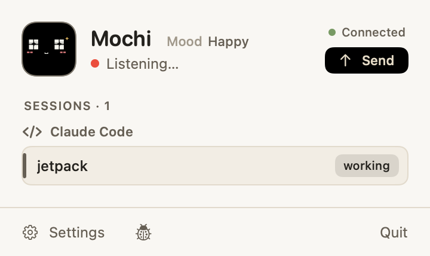
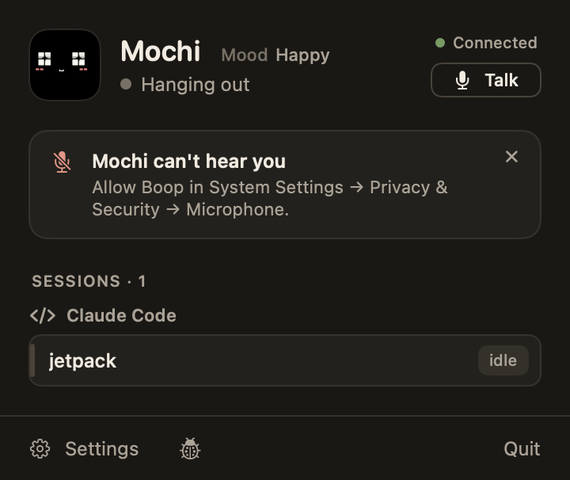
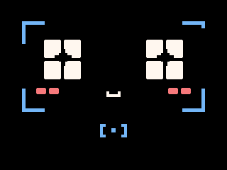
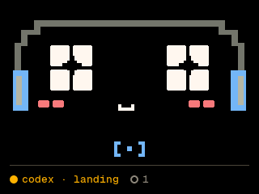

# Push-to-talk, with the words reaching the brain (2026-09-28)

The owner wanted to talk to Boop again. Hold BOOT (or click Talk in the
popover), speak, let go: the Mac's mic hears it, macOS turns it into
words on the Mac, and the words become a `talk` event that wakes the
brain, which answers with a face and a mumble
([BEHAVIORS.md](../../BEHAVIORS.md) §3.3,
[harness/EVENTS.md](../../harness/EVENTS.md) §2).

## What ran

| Check | Result |
| --- | --- |
| `make build` | Builds |
| `make -C internal test` | 277 passed after rebasing onto `main` (273, 9 runs in a row, before). Before that, `RuntimeTests.testTheScheduleFollowsTapsCheersAndTicks` failed 3 runs in 20 here (0 in 6 on `main`): its tap woke the scripted brain, whose reaction, finishing whenever it did, could hold the line the test checks. It now has a brain that never reacts |
| `make -C internal fw-test` | 140 of 140 passed after rebasing onto `main` |
| `make -C internal fw` | Builds: flash 77.4%, RAM 14.5% |
| `make -C internal sim` | 11 scenarios, 0 expect failures, 0 new or changed pictures (after the 6 new goldens) |
| `make -C internal tools-test` | 58, 11 and 3 tests, OK |
| `facegen.py --check` | 1,358 frames of 125 scenes match Chrome |
| `boopdev eval --list --only talk` | `35-talk-gets-an-answer.json` reads. Not run: it needs `BOOP_JEV_KEY` |
| `Boop --headless --brain scripted --debug`, with `{"dev":"listen"}` and `{"dev":"said"}` | Below |

**Headless.** Talk on, then off with no mic, then words:

```
talk: mic on (app)
link rules → {"t":"moment","anim":"listening"}
talk: mic off (app)
talk: heard nothing
link rules → {"t":"moment"}
▸ 1 talk: You said to Boop: "hey Boop, are the tests passing?"
link brain → {"t":"moment","say":{"syl":"ba-ki ma ki-ki ki-na-ga","word":"yay","at":8,"tune":"bounce","ms":115},"mood":"excited","loops":1}
brain talk 0 ms → react
```

and the transcript's line:

```json
{"seq":1,"ts":1790580772176,"source":"mic","type":"talk","specific_type":"app","data":{"words":"hey Boop, are the tests passing?"}}
```

## Pictures

The popover while listening, and after the mic was refused:

 

The device's `listening` scene, alone and while something needs you
(simulator goldens):

 

## Not checked

- The real mic and speech recognition: only the owner can run
  `make run` (Bluetooth), and macOS asks them for Microphone and Speech
  Recognition the first time.
- The board: it needs a reflash (`make flash`), and nothing ran on it.
- Jev's answers to what you say: `make eval` with the owner's key.
